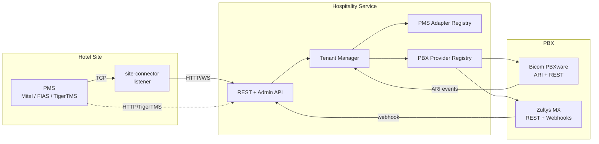
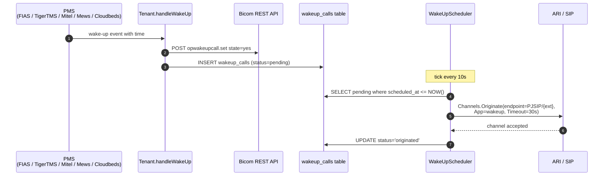

# Hospitality PMS Integration

> Multi-tenant Property Management System integration for hotel PBX systems

[](https://go.dev/)
[](LICENSE)

## Overview

This service connects hotel Property Management Systems (PMS) to PBX systems,
enabling automatic synchronization of guest check-ins, message waiting
indicators, room phone configuration, voicemail cleanup on checkout, and
wake-up call scheduling.

Two binaries are shipped:

| Binary | Role | DB | HTTP API |
|---|---|---|---|
| **`bicom-hospitality`** | Main service. Runs the per-tenant PMS↔PBX pipelines plus REST/Admin API. | required | yes |
| **`site-connector`** | Standalone PMS listener agent for the hotel LAN. Forwards events upstream over HTTP/WebSocket. | optional | no |

Both are built from this repo and share the protocol adapter layer.

### Supported PBX Providers

| Provider | Type | Status |
|----------|------|--------|
| **Bicom PBXware** | Asterisk-based (ARI + REST) | ✅ Implemented |
| **Zultys MX** | Webhook-based (Session Auth) | ✅ Implemented |

### Supported PMS Protocols

| Protocol | Adapter | Listener (server mode) | Status |
|----------|---------|------------------------|--------|
| **Mitel SX-200** | `pms/mitel` | `pms/listener/mitel_server` | ✅ Implemented |
| **FIAS/Fidelio** | `pms/fias` | `pms/listener/fias_server` | ✅ Implemented |
| **TigerTMS iLink** | `pms/tigertms` (HTTP webhook) | n/a | ✅ Implemented |

### Features

- **Multi-PBX Support**: Pluggable PBX backends (Bicom, Zultys, more)
- **Multi-Tenant**: Support multiple hotels on a single deployment
- **Two Modes**: Cloud (main service) and Edge (`site-connector` listener)
- **Real-time Sync**: Guest check-in/out immediately updates phone extensions
- **Message Waiting**: Automatic MWI lamp control from PMS (and from PBX voicemail webhooks)
- **Room Mapping**: Individual, range, and regex pattern mappings
- **Wake-Up Calls**: PMS drives a two-part pipeline — REST state
  toggle on the PBX + in-process `WakeUpScheduler` firing the actual
  call via ARI `Channels.Originate` at `scheduled_at`. Wake-up time
  parsed from PMS metadata (`TI` field for FIAS, `wakeup_time` for
  TigerTMS). Bicom only; Zultys loud-fails with a counter so
  misconfigurations surface in Prometheus.
- **Extension Management**: Update names, service plans
- **Voicemail Control**: Delete all messages and reset greeting on guest checkout
- **Webhook Support**: Receive PBX call events via HTTP (Bicom + Zultys)
- **Encryption at Rest**: AES-256-GCM for ARI passwords stored in PostgreSQL
- **Observability**: Prometheus metrics, Loki structured logs, optional WebSocket log tail

## Quick Start

### Prerequisites

- Go 1.24+
- PostgreSQL 15+
- (Optional) Bicom PBXware 7.2+ with ARI enabled and API key configured
- (Optional) Zultys MX with API access and webhook secret

### Installation

```bash
git clone https://github.com/sagostin/pbx-hospitality.git
cd pbx-hospitality
go mod download
make build         # builds both binaries into ./bin/
```

### Configuration

Configuration is loaded **from environment variables only** (`config.Load()` in
`internal/config/config.go`). `config/example.yaml` is a *reference template* —
it documents the env vars and DB schema, but is not parsed at runtime.

```bash
cp .env.example .env
# then edit .env and export its contents, or use Docker
```

Required:

| Env var | Purpose |
|---|---|
| `DB_HOST`, `DB_PORT`, `DB_USER`, `DB_PASSWORD`, `DB_NAME` | PostgreSQL connection |
| `ENCRYPTION_MASTER_KEY` | 32-byte AES key (base64-encoded). Required. ARI passwords are encrypted with this. |
| `ADMIN_API_KEY` | Header value for `X-Admin-Key` on `/admin/*` endpoints |

Optional:

| Env var | Purpose |
|---|---|
| `SERVER_PORT` | HTTP port (default `8080`) |
| `LOKI_ENABLED`, `LOKI_ENDPOINT` | Ship logs to Grafana Loki |
| `SERVICE_NAME` | Used as the WebSocket log-sink auth token |
| `LOG_LEVEL`, `LOG_FORMAT` | `debug`/`info`/`warn`/`error`, `json`/`console` |

### Running

```bash
docker compose up -d db                    # PostgreSQL
./bin/bicom-hospitality                    # main service, auto-migrates DB
```

The service auto-migrates the schema on first start. After it boots, create a
tenant via the admin API (or run the seeded example — see
[`migrations/seed.sql`](migrations/seed.sql)):

```bash
curl -X POST http://localhost:8080/admin/tenants \
  -H "X-Admin-Key: $ADMIN_API_KEY" \
  -H "Content-Type: application/json" \
  -d @examples/tenant-hotel-alpha.json
```

### Verify

```bash
curl http://localhost:8080/health
# {"status":"ok","database":"connected",...}

curl -H "X-Admin-Key: $ADMIN_API_KEY" http://localhost:8080/admin/tenants
# [...]
```

### Running `site-connector`

For hotels where the PMS pushes events to a local box, use `site-connector`:

```yaml
# config/config.yaml
site_connectors:
  - protocol: mitel
    listen_host: "0.0.0.0"
    listen_port: 23
    allowed_pms_ips: ["192.168.1.100"]
    output:
      url: "https://hospitality.example.com/api/v1/pbx/webhook/site-1"
      use_websocket: false
      buffer_enabled: true
      buffer_dir: "/var/spool/site-connector"
```

```bash
./bin/site-connector --list-protocols   # mitel, fias
./bin/site-connector
```

## Architecture



Key files:

- `internal/pms/protocol.go` — `Adapter`, `Listener`, registries
- `internal/pbx/interface.go` — `Provider`, `EventProvider`, `WebhookProvider`, `OriginateWakeUp`
- `internal/tenant/manager.go` — per-tenant pipeline (PMS → handler → PBX)
- `internal/wakeup/scheduler.go` — `WakeUpScheduler` (in-process, fires ARI originate at scheduled_at)
- `internal/db/db.go` — GORM models + AutoMigrate
- `internal/api/api.go` — Fiber HTTP routes

For a deeper view see [`docs/architecture.md`](docs/architecture.md).

## Wake-Up Call Pipeline



Two-part operation: the Bicom REST API only supports state toggling
(no time parameter), so the in-process `WakeUpScheduler` fires the
actual call at `scheduled_at` via ARI. Register a Stasis app named
`wakeup` in PBXware so `App=wakeup` lands somewhere that answers +
plays a greeting + hangs up. Zultys loud-fails with
`hospitality_pbx_wakeup_unsupported_total`.

Inspect at runtime:
```bash
curl -H "X-Admin-Key: $KEY" http://localhost:8080/admin/tenants/{id}/capabilities
curl -H "X-Admin-Key: $KEY" http://localhost:8080/admin/tenants/{id}/wakeups
```

## API Endpoints

### Public

| Method | Endpoint | Description |
|--------|----------|-------------|
| GET | `/health` | Health check (includes DB and per-tenant status) |
| GET | `/metrics` | Prometheus metrics |
| POST | `/api/v1/pbx/webhook/{tenant}` | PBX webhook receiver (Bicom + Zultys) |

### Tenants

| Method | Endpoint | Description |
|--------|----------|-------------|
| GET | `/api/v1/tenants` | List all tenants with status |
| GET | `/api/v1/tenants/{id}` | Get tenant details |
| GET | `/api/v1/tenants/{id}/status` | PMS/PBX connection status |
| GET | `/api/v1/tenants/{id}/rooms` | List room mappings |
| POST | `/api/v1/tenants/{id}/rooms` | Create room mapping (individual/range/regex) |
| GET | `/api/v1/tenants/{id}/sessions` | List active guest sessions |
| POST | `/api/v1/tenants/{id}/sessions` | Manually create a session |
| GET | `/api/v1/tenants/{id}/sessions/{room}` | Get session by room |
| DELETE | `/api/v1/tenants/{id}/sessions/{room}` | End a session |
| GET | `/api/v1/tenants/{id}/events` | Recent PMS events |

### Admin (requires `X-Admin-Key`)

| Group | Endpoints |
|-------|-----------|
| `/admin/tenants` | CRUD + bulk import + per-tenant rooms/sessions/events + `/{id}/capabilities` |
| `/admin/sites` | CRUD + per-site bicom-system mapping |
| `/admin/bicom-systems` | CRUD + `/{id}/ari-secret` rotation |
| `/admin/pbx` | `GET /status`, `POST /reload`, `POST /{id}/reload` |

`GET /admin/tenants/{id}/capabilities` returns runtime PMS/PBX capability flags — use it to detect misconfigurations like a Zultys tenant receiving PMS wake-up events.

### Inbound PMS

| Method | Endpoint | Description |
|--------|----------|-------------|
| POST | `/tigertms/{tenant}/API/*` | TigerTMS inbound (mounted per-tenant on startup) |
| GET  | `/ws/logs` | WebSocket log tail (auth via `SERVICE_NAME`) |

Full reference: [`docs/api-reference.md`](docs/api-reference.md) and
[`docs/admin-api.md`](docs/admin-api.md).

## Development

### Run Tests

```bash
make test                # verbose, -race, -cover
make test-quick          # CI mode
go test ./...            # any way you like
```

Tests use ephemeral ports (`localhost:0` → OS-assigned) so they do not require
root. They DO require a working network stack (loopback).

### Project Structure

```
├── cmd/
│   ├── bicom-hospitality/   # Main service entry point (DB + API + tenants)
│   └── site-connector/      # Standalone PMS listener (no DB, no API)
├── internal/
│   ├── api/                 # REST + Admin API (Fiber)
│   ├── ari/                 # ARI helper package (legacy / unused)
│   ├── bicom/               # Bicom REST client + MultiProvider helper
│   ├── config/              # Env-var config loader
│   ├── crypto/              # AES-256-GCM + auth-code hashing
│   ├── db/                  # GORM models + repository
│   ├── logging/             # zerolog + Loki shipper
│   ├── metrics/             # Prometheus collectors
│   ├── output/              # Resilient HTTP/WS output for site-connector
│   ├── pbx/                 # PBX provider abstraction
│   │   ├── bicom/           # Bicom provider (REST + ARI + webhook)
│   │   └── zultys/          # Zultys provider (session + webhook)
│   ├── pms/                 # PMS protocol adapters
│   │   ├── fias/            # FIAS/Fidelio (client mode)
│   │   ├── listener/        # Server-mode listeners for fias + mitel
│   │   ├── mitel/           # Mitel SX-200 (client mode)
│   │   └── tigertms/        # TigerTMS HTTP middleware
│   ├── tenant/              # Per-tenant event pipeline + room mapper
│   └── websocket/           # WebSocket log sink (and legacy cloud bridge)
├── migrations/              # Optional SQL schema + seed
├── config/                  # YAML reference (not parsed at runtime)
├── docs/                    # User documentation
└── scripts/                 # Admin Python helpers
```

## Documentation

### Guides

- [Architecture](docs/architecture.md) — System design, components, sequence diagrams
- [Data Flow Index](docs/DATA-FLOW.md) — single-page mermaid index of every flow
- [PBX Providers](docs/pbx-providers.md) — Bicom, Zultys, how to add a new one
- [Deployment](docs/deployment.md) — Production deployment
- [Protocols](docs/protocols.md) — PMS protocol specifications
- [Future Considerations](docs/future-considerations.md) — Roadmap

### API & Reference

- [API Reference](docs/api-reference.md) — Public REST API
- [Admin API](docs/admin-api.md) — `/admin/*` endpoints
- [Bicom API](docs/bicom-api.md) — Bicom PBXware API details
- [TigerTMS Integration](docs/tigertms.md) — TigerTMS REST adapter

### Resources

- [PBXware API Postman Collection](docs/bicom/PBXwareAPI_Doc.postman_collection.json)

## Contributing

PRs welcome. Please run `make test` before submitting.

## License

MIT