# Data Flow & Architecture Index

Single-page index of every data flow in the service, with the
mermaid diagrams inline. Read this first if you're onboarding; each
section points at the canonical doc for the long-form description.

Mermaid conventions used in this file:
- Node labels in flowcharts may use ` ` for line breaks.
- Edge labels are single-line only.
- Sequence diagram messages may use ` ` for line breaks.
- Participant aliases in sequence diagrams are single-line.

---

## 1. System Topology

Two binaries (`bicom-hospitality`, `site-connector`) plus the
supported PMS / PBX shapes.

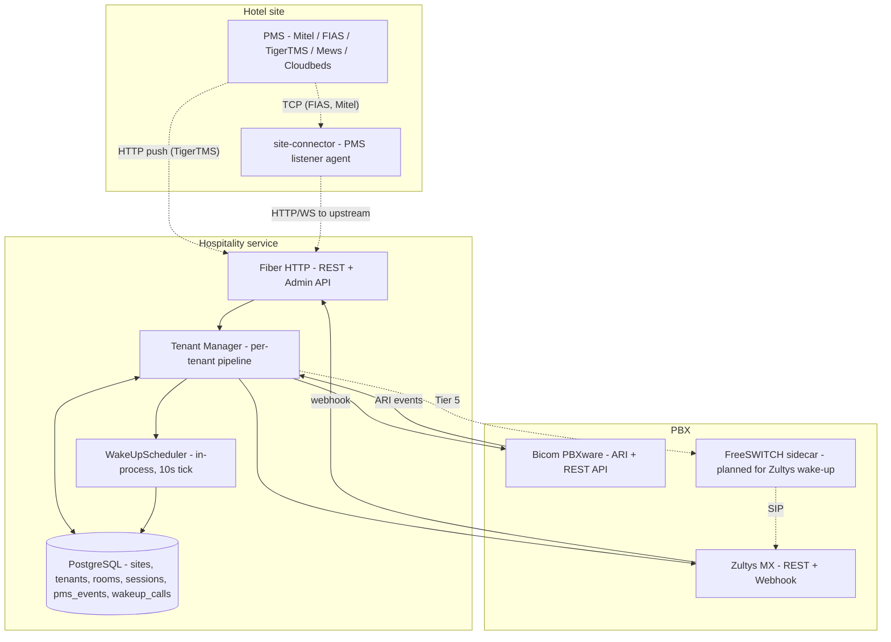

Canonical docs: [architecture.md](architecture.md), [pbx-providers.md](pbx-providers.md).

---

## 2. Per-Tenant PMS Event Pipeline

How a single PMS event flows from the wire into a PBX action.

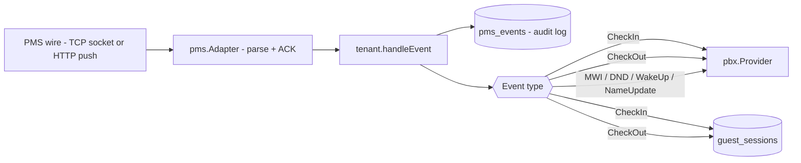

Canonical docs: [architecture.md#event-processor](architecture.md).

---

## 3. Wake-Up Call Pipeline (Tier 0 + Tier 1)

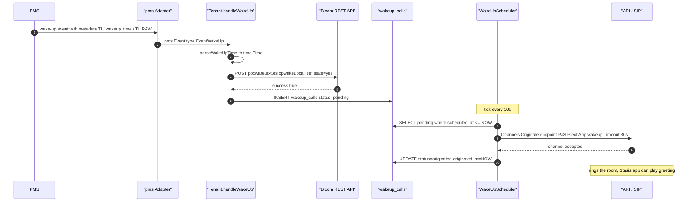

Canonical doc: [pbx-providers.md#wake-up-call-pipeline-tier-0--tier-1](pbx-providers.md).

---

## 4. Guest Check-Out Side Effects

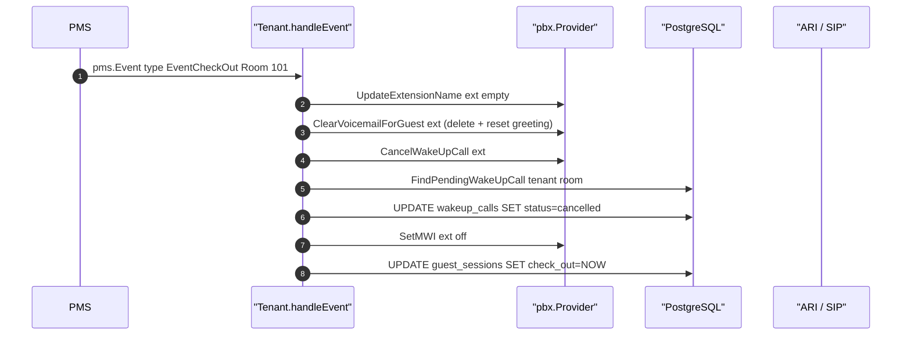

Canonical doc: [architecture.md#check-out-flow-cleanup--db-end-of-session](architecture.md).

---

## 5. PBX → PMS Reverse Flow (voicemail webhook → MWI)

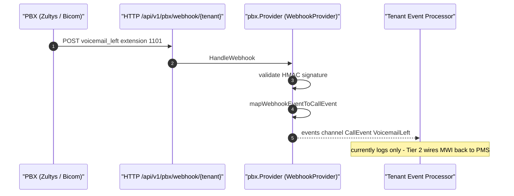

Canonical doc: [architecture.md#pbx--pms-reverse-flow-voicemail-webhook--mwi](architecture.md).

---

## 6. site-connector Forwarding Flow

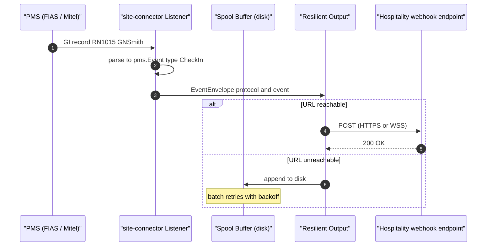

Canonical doc: [architecture.md#site-connector-forwarding-flow](architecture.md).

---

## 7. Protocol Topology (PMS-side)

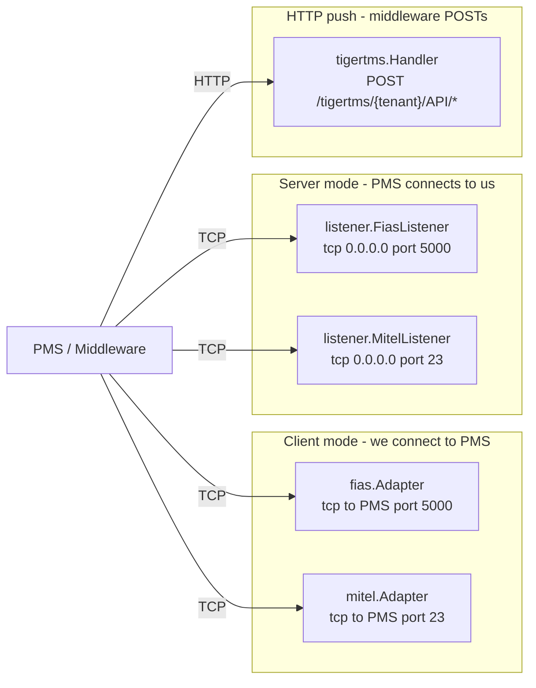

Canonical doc: [protocols.md](protocols.md).

---

## 8. PBX Capability Surface

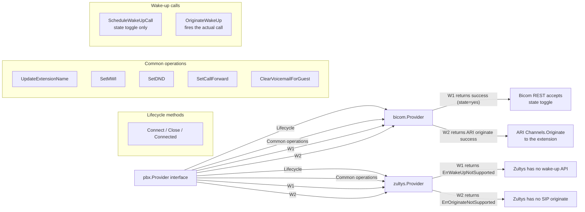

See the [Bicom](#bicom-capabilities) and [Zultys](#zultys-capabilities)
sections below for the full capability matrix.

### Bicom capabilities

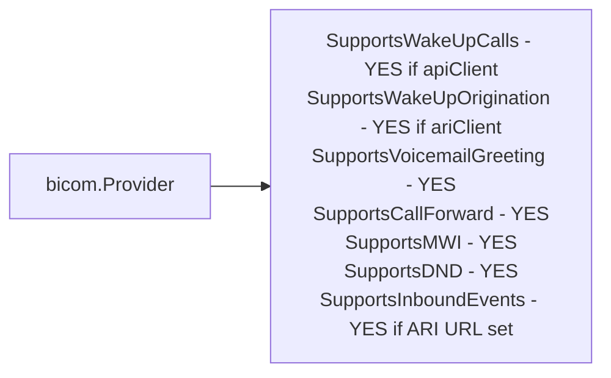

### Zultys capabilities

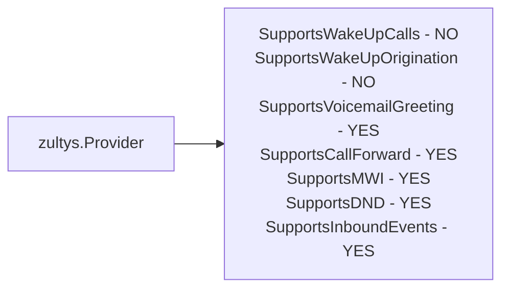

Canonical doc: [pbx-providers.md](pbx-providers.md).

---

## 9. Admin API Surface

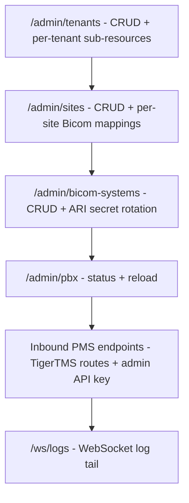

Canonical docs: [api-reference.md](api-reference.md), [admin-api.md](admin-api.md).

---

## 10. Database Schema

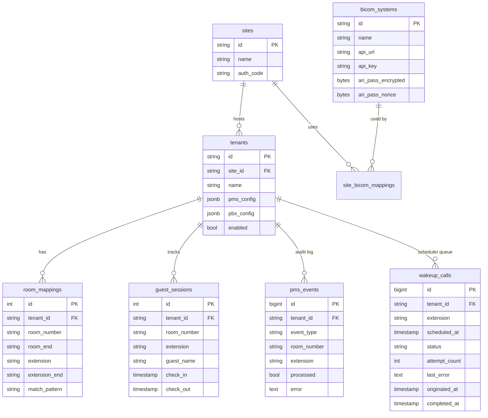

Canonical docs: [migrations/001_schema.sql](../migrations/001_schema.sql),
[migrations/003_wakeup_calls.sql](../migrations/003_wakeup_calls.sql),
[architecture.md](../docs/architecture.md).

---

## 11. Read-Order Index

If you're onboarding to the codebase, read in this order:

1. [README.md](../README.md) — what the service is, quick start
2. This file (DATA-FLOW.md) — how data flows
3. [architecture.md](architecture.md) — full sequence diagrams + DB schema
4. [pbx-providers.md](pbx-providers.md) — provider capabilities, wake-up pipeline
5. [protocols.md](protocols.md) — PMS wire format reference
6. [api-reference.md](api-reference.md) + [admin-api.md](admin-api.md) — HTTP surface
7. [deployment.md](deployment.md) — go from code to running service
8. [ROADMAP.md](../ROADMAP.md) — what's done, what's next