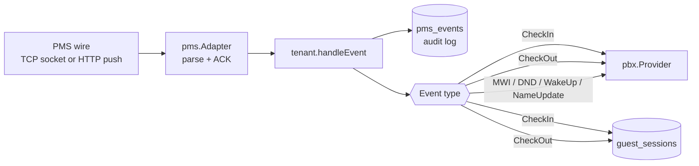
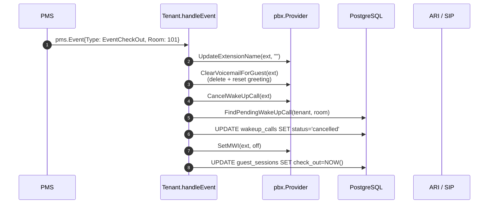
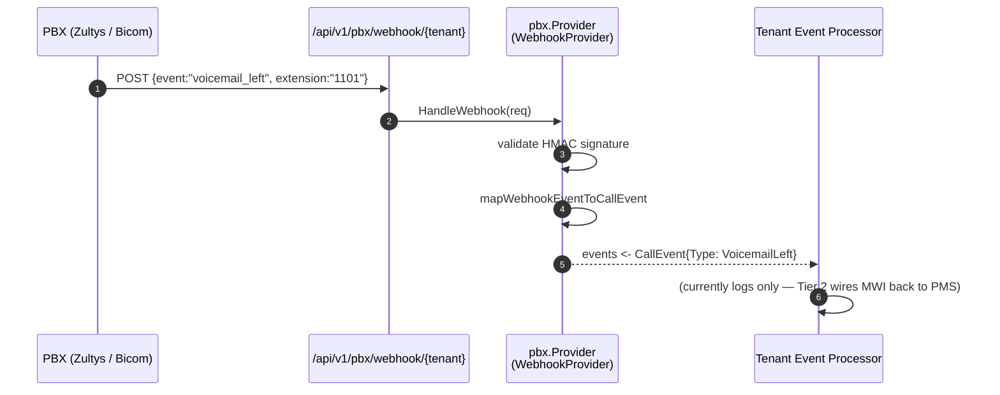
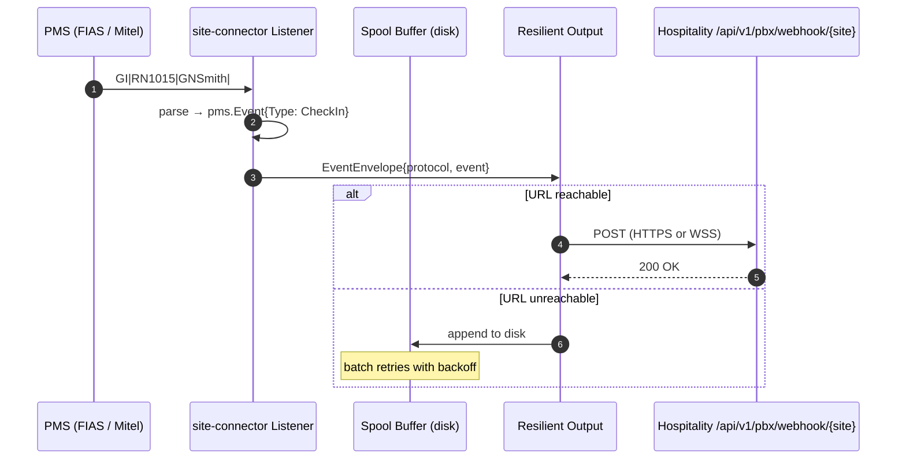
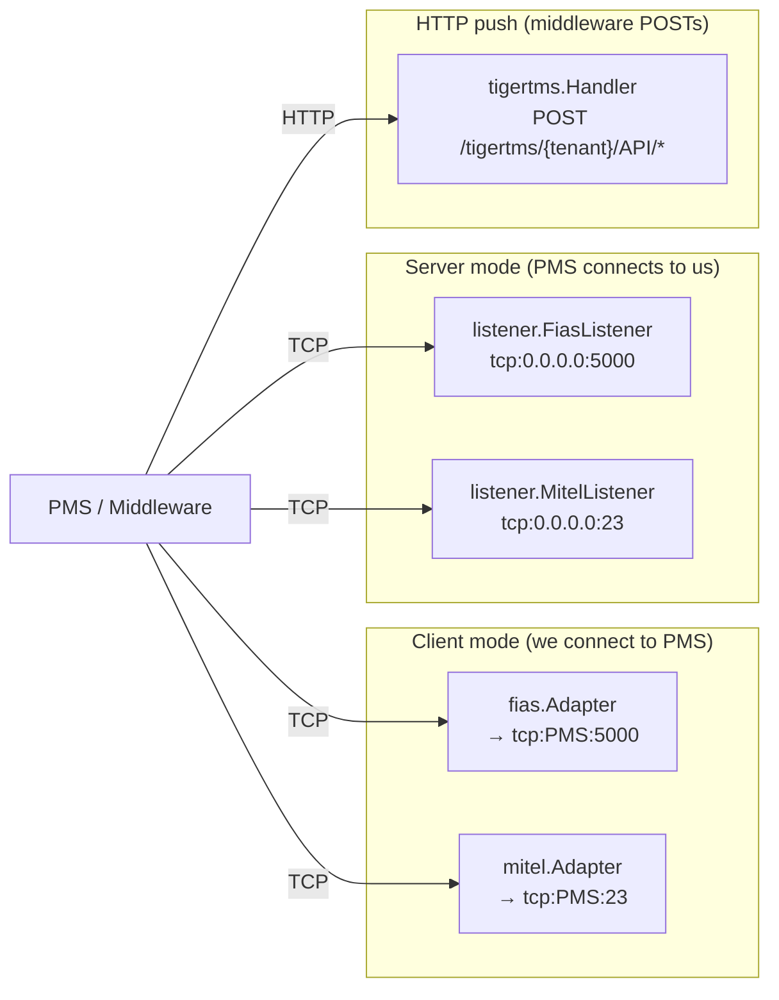
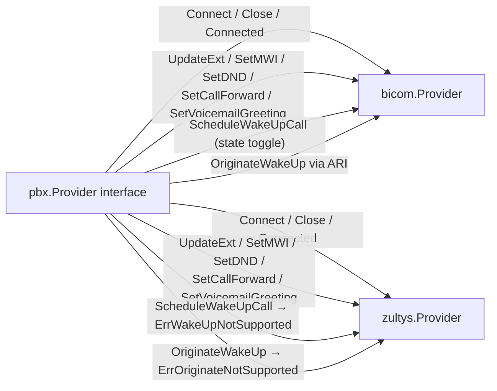
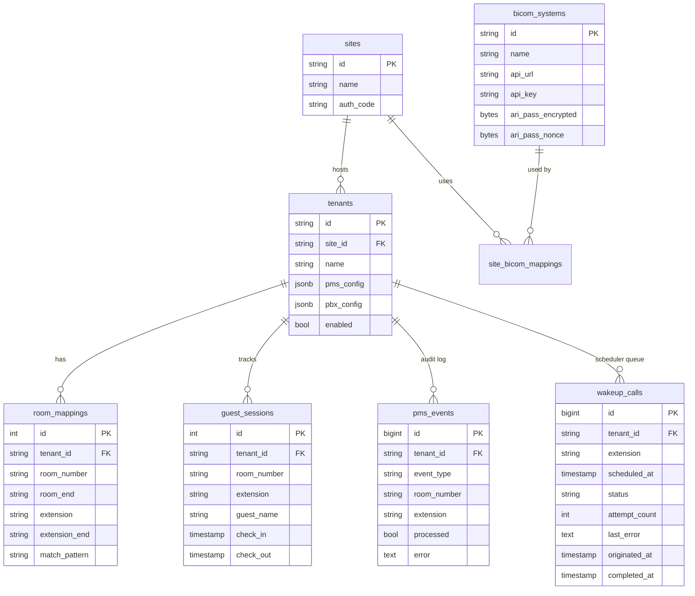

# Data Flow & Architecture Index

Single-page index of every data flow in the service, with the
mermaid diagrams inline. Read this first if you're onboarding; each
section points at the canonical doc for the long-form description.

---

## 1. System Topology

Two binaries (`bicom-hospitality`, `site-connector`) plus the
supported PMS / PBX shapes.

```mermaid
flowchart TB
    subgraph Hotel["Hotel site"]
        PMS[PMS<br/>Mitel / FIAS / TigerTMS / Mews / Cloudbeds]
        SC[site-connector<br/>PMS listener agent]
    end

    subgraph Cloud["Hospitality service"]
        API[/Fiber HTTP<br/>REST + Admin API/]
        TM[Tenant Manager<br/>per-tenant pipeline]
        Sched[WakeUpScheduler<br/>in-process, 10s tick]
        DB[(PostgreSQL<br/>sites · tenants<br/>rooms · sessions<br/>pms_events · wakeup_calls)]
    end

    subgraph PBX["PBX"]
        Bicom[Bicom PBXware<br/>ARI + REST API]
        Zultys[Zultys MX<br/>REST + Webhook]
        FS[FreeSWITCH<br/>sidecar<br/>(planned for Zultys wake-up)]
    end

    PMS -. "TCP (FIAS, Mitel)" .-> SC
    PMS -. "HTTP push (TigerTMS)" .-> API
    SC -. "HTTP/WS to upstream" .-> API

    API --> TM
    TM <--> DB
    TM --> Sched
    Sched --> DB
    TM --> Bicom
    TM --> Zultys
    TM -. "Tier 5" .-> FS
    FS -. "SIP" .-> Zultys

    Bicom -- "ARI events" --> TM
    Zultys -- "webhook" --> API
```

Canonical docs: [architecture.md](architecture.md), [pbx-providers.md](pbx-providers.md).

---

## 2. Per-Tenant PMS Event Pipeline

How a single PMS event flows from the wire into a PBX action.



Canonical docs: [architecture.md#event-processor](architecture.md).

---

## 3. Wake-Up Call Pipeline (Tier 0 + Tier 1)

```mermaid
sequenceDiagram
    autonumber
    participant PMS as PMS
    participant Adapter as pms.Adapter
    participant Tenant as Tenant.handleWakeUp
    participant REST as Bicom REST API
    participant DB as wakeup_calls
    participant Sched as WakeUpScheduler
    participant ARI as ARI / SIP

    PMS->>Adapter: wake-up event<br/>Metadata: {TI / wakeup_time / TI_RAW}
    Adapter->>Tenant: pms.Event{Type: EventWakeUp}
    Tenant->>Tenant: parseWakeUpTime(timeStr) → time.Time
    Tenant->>REST: POST pbxware.ext.es.opwakeupcall.set state=yes
    REST-->>Tenant: {success: true}
    Tenant->>DB: INSERT wakeup_calls status='pending'
    Note over Sched: tick every 10s
    Sched->>DB: SELECT pending where scheduled_at <= NOW()
    Sched->>ARI: Channels.Originate(<br/>endpoint=PJSIP/{ext},<br/>App=wakeup, Timeout=30s)
    ARI-->>Sched: channel accepted
    Sched->>DB: UPDATE status='originated', originated_at=NOW()
    Note over ARI: rings the room; Stasis app can play greeting
```

Canonical doc: [pbx-providers.md#wake-up-call-pipeline-tier-0--tier-1](pbx-providers.md).

---

## 4. Guest Check-Out Side Effects



Canonical doc: [architecture.md#check-out-flow-cleanup--db-end-of-session](architecture.md).

---

## 5. PBX → PMS Reverse Flow (voicemail webhook → MWI)



Canonical doc: [architecture.md#pbx--pms-reverse-flow-voicemail-webhook--mwi](architecture.md).

---

## 6. site-connector Forwarding Flow



Canonical doc: [architecture.md#site-connector-forwarding-flow](architecture.md).

---

## 7. Protocol Topology (PMS-side)



Canonical doc: [protocols.md](protocols.md).

---

## 8. PBX Capability Surface

| Capability | Bicom | Zultys |
|---|---|---|
| `SupportsWakeUpCalls` | ✅ (state toggle) | ❌ |
| `SupportsWakeUpOrigination` | ✅ (ARI Channels.Originate) | ❌ |
| `SupportsVoicemailGreeting` | ✅ | ✅ |
| `SupportsCallForward` | ✅ | ✅ |
| `SupportsMWI` | ✅ | ✅ |
| `SupportsDND` | ✅ | ✅ |
| `SupportsInboundEvents` | ✅ (ARI) | ✅ (webhook) |



Canonical doc: [pbx-providers.md](pbx-providers.md).

---

## 9. Admin API Surface

```mermaid
graph LR
    subgraph Tenants["/admin/tenants"]
        T1[CRUD]
        T2[/:id/rooms/]
        T3[/:id/sessions/]
        T4[/:id/events/]
        T5[/:id/wakeups/]
        T6[/:id/health]
        T7[/:id/capabilities]
        T8[/import]
    end

    subgraph Sites["/admin/sites"]
        S1[CRUD]
        S2[/:id/bicom]
        S3[/:id/health]
    end

    subgraph PBX["/admin/bicom-systems"]
        B1[CRUD]
        B2[/:id/ari-secret]
    end

    subgraph Mgr["/admin/pbx"]
        M1[GET /status]
        M2[POST /reload]
        M3[POST /:id/reload]
    end

    Inbound[Inbound PMS endpoints]
    WS[/ws/logs]

    Tenants --- Sites
    Sites --- PBX
    PBX --- Mgr
    Mgr --- Inbound
    Inbound --- WS
```

Canonical docs: [api-reference.md](api-reference.md), [admin-api.md](admin-api.md).

---

## 10. Database Schema



Canonical docs: [migrations/001_schema.sql](../migrations/001_schema.sql), [migrations/003_wakeup_calls.sql](../migrations/003_wakeup_calls.sql), [architecture.md](../docs/architecture.md).

---

## 11. Read-Order Index

If you're onboarding to the codebase, read in this order:

1. [README.md](../README.md) — what the service is, quick start
2. This file (DATA-FLOW.md) — how data flows
3. [architecture.md](architecture.md) — full sequence diagrams + DB schema
4. [pbx-providers.md](pbx-providers.md) — provider capabilities, wake-up pipeline
5. [protocols.md](protocols.md) — PMS wire format reference
6. [api-reference.md](api-reference.md) + [admin-api.md](admin-api.md) — HTTP surface
7. [deployment.md](deployment.md) — go from code to running service
8. [ROADMAP.md](../ROADMAP.md) — what's done, what's next