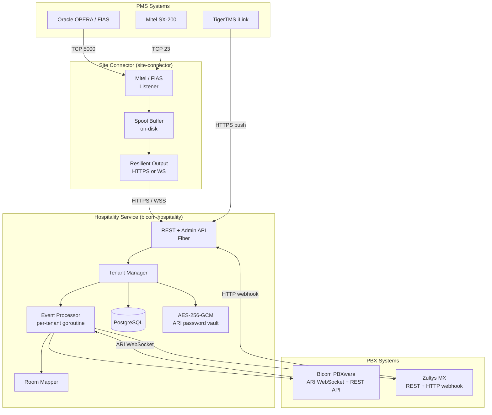
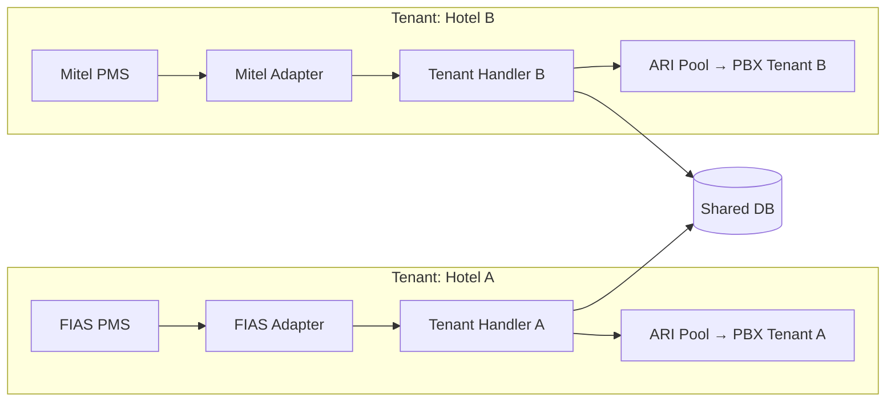
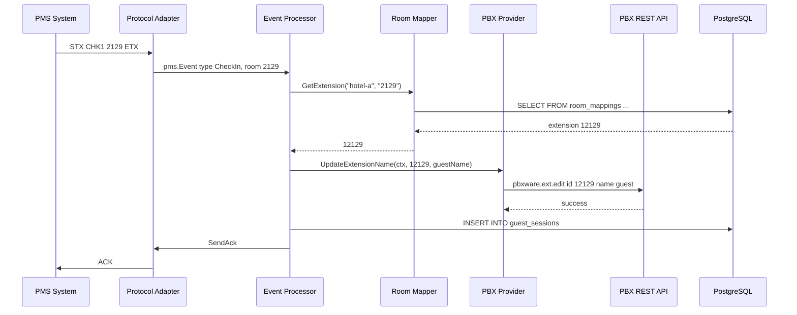
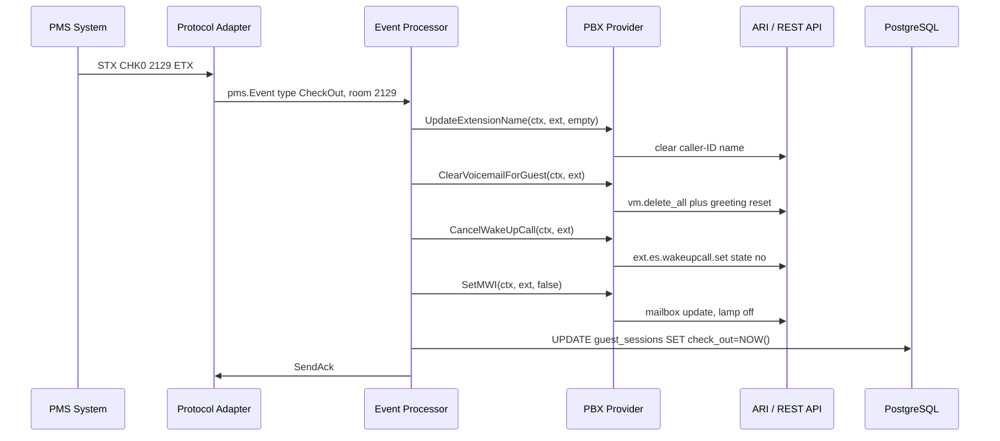
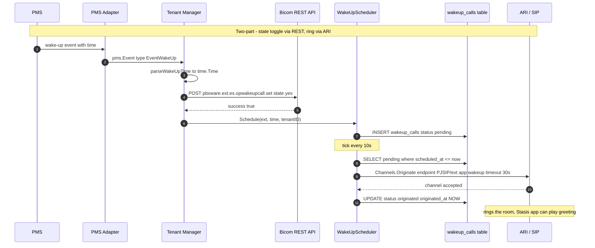
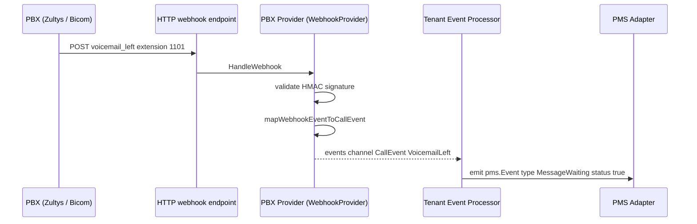
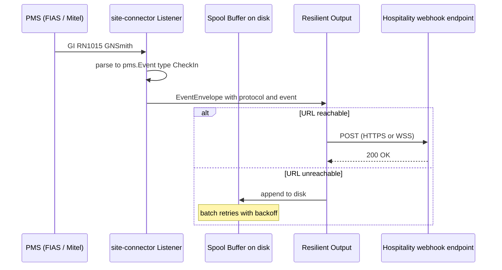
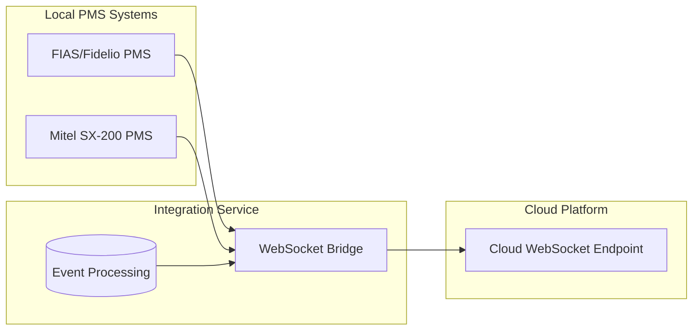

# Hospitality PMS Integration - Architecture

## Overview

This document describes the architecture for a **multi-tenant hospitality integration** that connects Property Management Systems (PMS) to multiple PBX backends through a provider abstraction layer. The system supports multiple PMS protocols and PBX providers with per-tenant isolation.

### System Topology

The system ships as **two binaries** that share the protocol layer:

- **`bicom-hospitality`** — the cloud/main service. Owns the database, the REST + Admin API, and runs one pipeline per tenant. PMS systems either push events directly to it (TigerTMS HTTP) or via a local `site-connector` agent.
- **`site-connector`** — an edge listener agent. Runs at the hotel on the PMS LAN. Accepts FIAS or Mitel connections, parses events, and forwards them upstream over HTTPS or WebSocket.



See [PBX Providers Guide](pbx-providers.md) for detailed provider documentation.

---


## PMS Protocol Support

### Oracle FIAS/Fidelio Protocol

FIAS is the industry-standard protocol for hotel PMS integration, used by Oracle OPERA and similar systems.

| Aspect | Details |
|--------|---------|
| **Transport** | TCP/IP |
| **Message Format** | Structured records with defined field types |
| **Link Setup** | `LR` (Link Record) establishes active record types |
| **Record Types** | `GI` (Guest In), `GO` (Guest Out), `MW` (Message Waiting), etc. |
| **Fields** | `RN` (Room Number), `GN` (Guest Name), `DA` (Date), etc. |

**Example Messages:**
```
LR|DA|TI|RN|GN|FL|RI|
GI|RN1015|GNSmith, John|DA250102|
GO|RN1015|DA250102|
MW|RN1015|FL1|
```

### Mitel SX-200 / MiVoice Protocol

Legacy ASCII-based protocol with control character framing.

| Aspect | Details |
|--------|---------|
| **Transport** | Serial RS-232 or TCP/IP (Telnet) |
| **Framing** | `STX` (0x02) start, `ETX` (0x03) end |
| **Handshaking** | `ENQ` → device responds with `ACK` or `NAK` |
| **Message Length** | Fixed 10-char payload (function + status + room#) |
| **Room Number** | 5 digits, left-padded with spaces |

### TigerTMS iLink REST API

Modern HTTP-based middleware for hotel PMS integration.

| Aspect | Details |
|--------|---------|
| **Transport** | HTTP/HTTPS REST API |
| **Direction** | TigerTMS pushes to our endpoints |
| **Format** | Query parameters or JSON body |
| **Authentication** | Bearer token or API key |
| **Endpoints** | `setguest`, `setmw`, `setdnd`, `setwakeup`, etc. |

See [TigerTMS Integration Guide](tigertms.md) for complete endpoint documentation.

**Function Codes:**
| Code | Function | Status Values |
|------|----------|---------------|
| `CHK` | Check-In/Out | `1` = in, `0` = out |
| `NAM` | Set Guest Name | `1` = add name |
| `MW ` | Message Waiting | `1` = on, `0` = off |
| `RM ` | Room Status | `1` = occupied |
| `DND` | Do Not Disturb | `1` = on, `0` = off |

**Example Messages:**
```
<STX>CHK1 2129<ETX>    # Check-in room 2129
<STX>CHK0 2129<ETX>    # Check-out room 2129
<STX>MW 1 2129<ETX>    # Message waiting ON for 2129
<STX>NAM1 2129<ETX>    # Name data follows for 2129
```

---

## Multi-Tenant Architecture

Each tenant represents a distinct hotel/property with its own:
- PMS connection configuration
- Bicom PBXware tenant/extensions
- Room-to-extension mapping
- Integration settings



### Tenant Configuration

In the DB-first architecture, tenant configuration is managed entirely through the database and Admin API. The `config.yaml` file contains only server-level settings.

**config.yaml (server settings only):**
```yaml
server:
  port: 8080

database:
  host: "10.0.0.5"
  port: 5432
  user: "hospitality"
  password: "${DB_PASSWORD}"
  database: "hospitality"
  ssl_mode: "require"

crypto:
  master_key: "${ENCRYPTION_MASTER_KEY}"

logging:
  level: "info"
  format: "json"
```

**Database Schema (tenants table):**
```sql
CREATE TABLE tenants (
    id          VARCHAR(64) PRIMARY KEY,
    name        VARCHAR(255) NOT NULL,
    pms_config  JSONB NOT NULL,
    pbx_config  JSONB NOT NULL,
    settings    JSONB DEFAULT '{}',
    enabled     BOOLEAN DEFAULT true,
    created_at  TIMESTAMPTZ DEFAULT NOW(),
    updated_at  TIMESTAMPTZ DEFAULT NOW()
);
```

**Admin API for Tenant Management:**
| Method | Endpoint | Description |
|--------|----------|-------------|
| `GET` | `/admin/tenants` | List all tenants |
| `POST` | `/admin/tenants` | Create tenant |
| `GET` | `/admin/tenants/{id}` | Get tenant details |
| `PUT` | `/admin/tenants/{id}` | Update tenant |
| `DELETE` | `/admin/tenants/{id}` | Remove tenant |
| `POST` | `/admin/tenants/import` | Bulk import tenants |

**Admin API for Site Management:**
| Method | Endpoint | Description |
|--------|----------|-------------|
| `GET` | `/admin/sites` | List all sites |
| `POST` | `/admin/sites` | Create site |
| `GET` | `/admin/sites/{id}` | Get site details |
| `PUT` | `/admin/sites/{id}` | Update site |
| `DELETE` | `/admin/sites/{id}` | Remove site |
| `GET` | `/admin/sites/{id}/health` | Get site health |
| `GET` | `/admin/sites/{id}/bicom` | List site PBX mappings |
| `POST` | `/admin/sites/{id}/bicom` | Add PBX to site |
| `DELETE` | `/admin/sites/{id}/bicom/{bicomSystemId}` | Remove PBX from site |

**Admin API for Bicom Systems:**
| Method | Endpoint | Description |
|--------|----------|-------------|
| `GET` | `/admin/bicom-systems` | List all PBX systems |
| `POST` | `/admin/bicom-systems` | Create PBX system |
| `GET` | `/admin/bicom-systems/{id}` | Get PBX details |
| `PUT` | `/admin/bicom-systems/{id}` | Update PBX system |
| `DELETE` | `/admin/bicom-systems/{id}` | Remove PBX system |
| `PUT` | `/admin/bicom-systems/{id}/ari-secret` | Update ARI password |

**Admin API for PBX Management:**
| Method | Endpoint | Description |
|--------|----------|-------------|
| `GET` | `/admin/pbx/status` | List PBX connection status |
| `POST` | `/admin/pbx/reload` | Reload all PBX systems |
| `POST` | `/admin/pbx/{id}/reload` | Reload specific PBX system |

---

## Core Components

### 1. Protocol Adapter Layer

Abstraction over PMS protocols with a common interface:

```go
type PMSAdapter interface {
    // Connect establishes the PMS connection
    Connect(ctx context.Context) error
    
    // Events returns a channel of parsed PMS events
    Events() <-chan PMSEvent
    
    // SendAck sends acknowledgement to PMS
    SendAck(eventID string) error
    
    // Close terminates the connection
    Close() error
}

type PMSEvent struct {
    Type      EventType     // CheckIn, CheckOut, MessageWaiting, etc.
    Room      string
    GuestName string
    Timestamp time.Time
    RawData   []byte
    Metadata  map[string]string
}

type EventType int
const (
    EventCheckIn EventType = iota
    EventCheckOut
    EventMessageWaiting
    EventNameUpdate
    EventRoomStatus
    EventDND
)
```

### 2. ARI Client with Connection Pool

Using the CyCoreSystems ARI library for Asterisk integration:

```go
type ARIPool struct {
    clients map[string]ari.Client  // keyed by tenant ID
    mu      sync.RWMutex
}

// Actions exposed to tenant handlers
type TenantARI interface {
    SetCallerIDName(ext, name string) error
    SetMessageWaiting(ext string, on bool) error
    SetDND(ext string, on bool) error
    Originate(from, to string, opts ...OriginateOpt) (*ari.ChannelHandle, error)
}
```

### 3. Room-Extension Mapping Service

Maps PMS room numbers to PBXware extensions:

```go
type RoomMapper interface {
    GetExtension(tenantID, roomNumber string) (string, error)
    GetRoom(tenantID, extension string) (string, error)
    SetMapping(tenantID, roomNumber, extension string) error
}
```

**Mapping Strategies:**
- **Direct**: Room 101 → Extension 101
- **Prefixed**: Room 101 → Extension 1101 (tenant prefix)
- **Custom**: Database lookup per room
- **Range**: Room 101-105 → Extension 201-205 (sequential offset)
- **Pattern**: Regex match (e.g., `10[0-5]\d` → Extension 500)

**Lookup Order:** Exact match → Range → Pattern → Prefix fallback

### 4. Event Processor

Orchestrates PMS events to PBX actions.

#### Check-In Flow (PMS → extension update)



#### Check-Out Flow (cleanup + DB end-of-session)



#### Wake-Up Call Flow (PMS-driven, Bicom + ARI)



#### PBX-side voicemail → PMS-side MWI (when reverse webhook is configured)



#### `site-connector` Forwarding Flow



---

## Database Schema

```sql
-- Tenant configurations
CREATE TABLE tenants (
    id          VARCHAR(64) PRIMARY KEY,
    name        VARCHAR(255) NOT NULL,
    pms_config  JSONB NOT NULL,
    pbx_config  JSONB NOT NULL,
    settings    JSONB DEFAULT '{}',
    created_at  TIMESTAMPTZ DEFAULT NOW(),
    updated_at  TIMESTAMPTZ DEFAULT NOW()
);

-- Room-to-extension mappings (individual, range, or pattern-based)
CREATE TABLE room_mappings (
    id            SERIAL PRIMARY KEY,
    tenant_id     VARCHAR(64) REFERENCES tenants(id),
    room_number   VARCHAR(32) NOT NULL,        -- Start of range or exact room
    room_end      VARCHAR(32),                  -- Range end (NULL for individual)
    extension     VARCHAR(32) NOT NULL,         -- Extension or start of range
    extension_end VARCHAR(32),                  -- Range extension end (NULL for individual)
    match_pattern VARCHAR(128),                 -- Regex pattern (overrides room/extension)
    created_at    TIMESTAMPTZ DEFAULT NOW(),
    updated_at    TIMESTAMPTZ DEFAULT NOW(),
    UNIQUE(tenant_id, room_number)
);

-- Guest sessions for tracking check-in/out
CREATE TABLE guest_sessions (
    id          SERIAL PRIMARY KEY,
    tenant_id   VARCHAR(64) REFERENCES tenants(id),
    room_number VARCHAR(32) NOT NULL,
    guest_name  VARCHAR(255),
    check_in    TIMESTAMPTZ NOT NULL,
    check_out   TIMESTAMPTZ,
    extension   VARCHAR(32)
);

-- Audit log of PMS events
CREATE TABLE pms_events (
    id          BIGSERIAL PRIMARY KEY,
    tenant_id   VARCHAR(64) REFERENCES tenants(id),
    event_type  VARCHAR(32) NOT NULL,
    room_number VARCHAR(32),
    raw_data    BYTEA,
    processed   BOOLEAN DEFAULT FALSE,
    error       TEXT,
    created_at  TIMESTAMPTZ DEFAULT NOW()
);

-- Indexes
CREATE INDEX idx_guest_sessions_active ON guest_sessions(tenant_id, room_number) 
    WHERE check_out IS NULL;
CREATE INDEX idx_pms_events_unprocessed ON pms_events(tenant_id, created_at) 
    WHERE processed = FALSE;
```

---

## PBX Integration via ARI

### Bicom PBXware ARI Setup

Per the Bicom documentation for PBXware 7.2+:

1. **Register ARI Application**: Admin Settings → ARI → Add Application
2. **Configure Authentication**: Unique username/password per tenant
3. **IP Whitelisting**: Register integration server IP
4. **Assign Destinations**: DID/IVR routes can target ARI apps

### ARI Operations for Hospitality

| PMS Event | ARI Action | Notes |
|-----------|------------|-------|
| Check-In | Update endpoint state, set caller ID name | Enable outbound calling |
| Check-Out | Clear caller ID, delete voicemails | Disable toll access |
| Message Waiting | `mailboxes/{mailbox}` MWI update | LED/softkey indicator |
| Name Update | Update endpoint caller ID name | Display on outbound calls |
| DND | Set/clear DND state | Via feature code or direct |
| Wake-Up Call | Schedule originated call | Use Asterisk scheduler |

### CyCoreSystems ARI Library Usage

```go
import (
    "github.com/CyCoreSystems/ari/v6"
    "github.com/CyCoreSystems/ari/v6/client/native"
)

func NewARIClient(cfg *TenantConfig) (ari.Client, error) {
    return native.Connect(&native.Options{
        Application:  cfg.ARIAppName,
        URL:          cfg.ARIURL,      // http://pbx:8088/ari
        WebsocketURL: cfg.ARIWSUrl,    // ws://pbx:8088/ari/events
        Username:     cfg.ARIUser,
        Password:     cfg.ARIPass,
    })
}

// Subscribe to all events for the application
func (s *Service) subscribeEvents(client ari.Client) {
    sub := client.Bus().Subscribe(nil, ari.Events.All)
    for evt := range sub.Events() {
        switch e := evt.(type) {
        case *ari.StasisStart:
            s.handleIncomingCall(e)
        case *ari.StasisEnd:
            s.handleCallEnd(e)
        }
    }
}
```

---

## REST API

Public monitoring endpoints:

| Method | Endpoint | Description |
|--------|----------|-------------|
| `GET` | `/api/v1/tenants/{id}/rooms` | List room mappings |
| `GET` | `/api/v1/tenants/{id}/sessions` | Active guest sessions |
| `GET` | `/api/v1/tenants/{id}/events` | Recent PMS events |
| `GET` | `/health` | Health check |
| `GET` | `/metrics` | Prometheus metrics |

For admin API endpoints, see [Admin API Reference](admin-api.md).

---

## Observability

### Metrics (Prometheus)

```
# PMS connection status per tenant
pms_connection_status{tenant="hotel-a", protocol="fias"} 1

# Events processed
pms_events_total{tenant="hotel-a", type="checkin"} 1523
pms_events_total{tenant="hotel-a", type="checkout"} 1487

# Processing latency
pms_event_processing_seconds{tenant="hotel-a", type="checkin", quantile="0.99"} 0.045

# ARI connection health
ari_connection_status{tenant="hotel-a"} 1
ari_requests_total{tenant="hotel-a", method="originate"} 892
```

### Structured Logging

```json
{
  "level": "info",
  "ts": "2026-01-02T14:30:00Z",
  "msg": "guest check-in processed",
  "tenant_id": "hotel-alpha",
  "room": "2129",
  "extension": "12129",
  "guest_name": "Smith, John",
  "pms_protocol": "mitel",
  "latency_ms": 23
}
```

---

## Deployment

### Docker Compose Example

The repo ships a `docker-compose.yml` that defines the database and the app
service. See the file at the repo root for the current canonical form. A
typical reference:

```yaml
services:
  app:
    build: .
    image: pbx-hospitality:latest
    environment:
      SERVER_PORT: "8080"
      DB_HOST: db
      DB_PORT: "5432"
      DB_USER: hospitality
      DB_PASSWORD: ${DB_PASSWORD}
      DB_NAME: hospitality
      DB_SSL_MODE: disable
      ENCRYPTION_MASTER_KEY: ${ENCRYPTION_MASTER_KEY}
      ADMIN_API_KEY: ${ADMIN_API_KEY}
    ports:
      - "8080:8080"
    depends_on:
      - db
    healthcheck:
      test: ["CMD", "/app/bicom-hospitality", "--health-check"]
      interval: 30s
      timeout: 5s
      retries: 3

  db:
    image: postgres:15
    environment:
      POSTGRES_DB: hospitality
      POSTGRES_USER: hospitality
      POSTGRES_PASSWORD: ${DB_PASSWORD}
    volumes:
      - pgdata:/var/lib/postgresql/data

volumes:
  pgdata:
```

---

## Security Considerations

1. **Secrets Management**: Use environment variables or Vault for ARI passwords
2. **Network Segmentation**: PMS connections typically on isolated VLAN
3. **TLS**: Enable HTTPS for REST API, TLS for database connections
4. **Audit Logging**: All PMS events stored for compliance
5. **IP Whitelisting**: Bicom ARI restricts connections to configured IPs

---

## Bicom REST API Client

In addition to ARI for real-time call control, the integration uses the Bicom PBXware REST API for configuration:

| Feature | API Action | Description |
|---------|------------|-------------|
| **Wake-Up Calls** | `pbxware.ext.es.wakeupcall.edit` | Schedule/cancel wake-up calls |
| **Extension Name** | `pbxware.ext.edit` | Update caller ID name |
| **Service Plan** | `pbxware.ext.edit` | Change extension service plan |
| **Voicemail Delete** | `pbxware.vm.delete_all` | Clear all messages on checkout |
| **DND** | `pbxware.ext.es.dnd.edit` | Enable/disable Do Not Disturb |
| **Call Forward** | `pbxware.ext.es.callforward.edit` | Configure call forwarding |

See [Bicom API Reference](bicom-api.md) for full documentation.

---

## WebSocket Bridge to Cloud Platform

The WebSocket bridge provides a persistent connection for forwarding PMS events to the cloud platform, supporting multi-tenant routing and automatic reconnection.

### Overview



### Bridge Configuration

| Setting | Description | Default |
|---------|-------------|---------|
| `cloud_url` | WebSocket endpoint URL (wss://...) | Required |
| `tenant_id` | Tenant identifier for routing | Required |
| `auth_token` | Bearer token for authentication | Optional |
| `reconnect_base_delay` | Initial reconnection delay | 1s |
| `reconnect_max_delay` | Maximum reconnection delay | 60s |
| `ping_interval` | Keep-alive ping interval | 30s |

### JSON Message Format

Events forwarded to the cloud platform use this JSON format:

```json
{
  "type": "event",
  "payload": {
    "id": "uuid-v4",
    "tenant_id": "hotel-alpha",
    "event_type": "check_in",
    "room": "1015",
    "extension": "11015",
    "guest_name": "Smith, John",
    "status": true,
    "timestamp": "2026-01-15T10:30:00Z",
    "metadata": {
      "reservation_id": "RES-12345"
    }
  },
  "timestamp": "2026-01-15T10:30:00.123Z"
}
```

### Exponential Backoff

Reconnection uses exponential backoff with jitter to prevent thundering herd:

| Attempt | Base Delay | With Jitter (±25%) |
|---------|------------|-------------------|
| 1 | 1s | 0.75s - 1.25s |
| 2 | 2s | 1.5s - 2.5s |
| 3 | 4s | 3s - 5s |
| 4 | 8s | 6s - 10s |
| 5+ | Capped at 60s | 45s - 75s |

### Metrics

```
# WebSocket connection status per tenant
websocket_connection_status{tenant="hotel-alpha"} 1

# Last successful connection timestamp
websocket_last_connected_timestamp{tenant="hotel-alpha"} 1705315800

# Events sent to cloud
websocket_events_sent_total{tenant="hotel-alpha", event_type="check_in"} 1523

# Reconnection attempts
websocket_reconnections_total{tenant="hotel-alpha"} 12
```

---

## Future Extensions

- **Additional PMS Protocols**: Hilton PEP, Hyatt HIS, Generic HTNG
- **Billing Integration**: Call accounting records to PMS
- **Mini-bar Posting**: Extension dial codes for room charges
