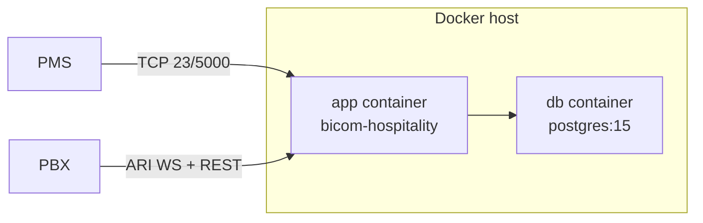
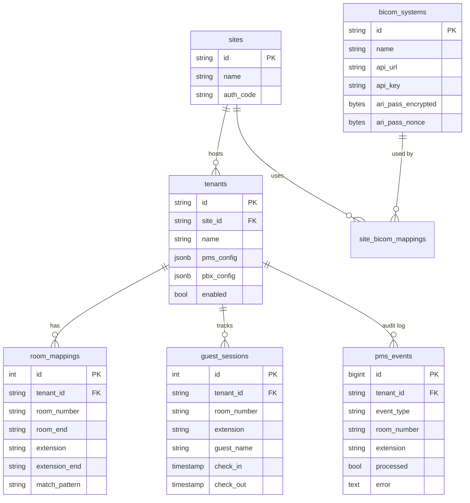

# Hospitality PMS Integration - Deployment Guide

This guide covers deploying the Hospitality PMS Integration service in production.

---

## Prerequisites

- **Docker** 24+ and Docker Compose
- **PostgreSQL** 15+ (or use included container)
- **PBX System**: Bicom PBXware 7.2+ with ARI, or Zultys MX
- **Network access** to PMS systems (TCP ports)

---

## Quick Start with Docker

### 1. Clone and Configure

```bash
git clone https://github.com/sagostin/pbx-hospitality.git
cd pbx-hospitality
cp .env.example .env
# edit .env: set DB_PASSWORD, ENCRYPTION_MASTER_KEY, ADMIN_API_KEY
```

Configuration is loaded **from environment variables only** at runtime —
`config/example.yaml` is a reference template, not parsed. The two
non-env knobs (per-tenant PMS / PBX config) live in PostgreSQL and are
managed through the Admin API. The bundled `migrations/002_seed.sql`
loads a sample tenant + site + Bicom system for dev installs:

```bash
psql -h localhost -U hospitality -d hospitality -f migrations/002_seed.sql
```

### 2. Boot the Stack

```bash
docker compose up -d
docker compose logs -f app   # confirm "Tenant loaded from database"
```



### 3. Create Environment File

```bash
cat > .env <<EOF
DB_PASSWORD=secure_password_here
# Encryption (required for ARI password storage)
ENCRYPTION_MASTER_KEY=$(openssl rand -base64 32)
# Bicom PBX
ARI_PASSWORD=your_ari_password
BICOM_API_KEY=your_api_key_from_pbxware
# Zultys PBX (if using)
ZULTYS_USERNAME=admin
ZULTYS_PASSWORD=your_zultys_password
ZULTYS_WEBHOOK_SECRET=random_secret_for_webhooks
EOF
```

> **Important**: The `ENCRYPTION_MASTER_KEY` must be a 32-byte value encoded as base64. Generate one with:
> ```bash
> openssl rand -base64 32
> ```
> The service will fail to start without this key.

### 4. Start Services

```bash
docker compose up -d
```

### 5. Verify

```bash
# Check health
curl http://localhost:8080/health

# View logs
docker compose logs -f hospitality
```

---

## Database Setup

### Schema Creation

Database schema is created automatically via GORM AutoMigrate on application
startup. The reference SQL (`migrations/001_schema.sql`) is kept in sync
manually so ops can inspect the schema without booting the service.

### Schema Overview



| Table | Purpose |
|-------|---------|
| `sites` | Physical property with auth code |
| `tenants` | Hotel instance with PMS/PBX config |
| `bicom_systems` | PBX connection configuration (ARI password AES-256-GCM encrypted) |
| `site_bicom_mappings` | Site-to-PBX associations |
| `room_mappings` | Room number → Extension mapping (individual / range / regex) |
| `guest_sessions` | Check-in/out history |
| `pms_events` | Audit log of all PMS events; backs the admin retry queue |

---

## Bicom PBXware Configuration

### 1. Enable ARI

1. Go to **Admin Settings → ARI**
2. Add new ARI application:
   - **Application Name**: `hospitality`
   - **Username**: `hospitality`
   - **Password**: (save for config)
3. Whitelist the integration server IP

### 2. Generate API Key

1. Go to **Admin Settings → API Keys**
2. Create new key with permissions:
   - Extension Read/Write
   - Voicemail Delete
   - Enhanced Services

### 3. Service Plans (Optional)

Create service plans for guest extensions:
- `guest-active` - Full outbound calling
- `guest-restricted` - Internal only
- `guest-disabled` - No outgoing calls

See [PBX Providers Guide](pbx-providers.md) for more details.

---

## Zultys MX Configuration

### 1. Create API User

Create a user with API access permissions for session-based authentication.

### 2. Configure Webhook

Set up Zultys to POST call events to:
```
https://your-server/api/v1/pbx/webhook/{tenant-id}
```

### 3. Limitations

- **Wake-up calls**: Not natively supported (see [future considerations](future-considerations.md))

See [PBX Providers Guide](pbx-providers.md) for complete Zultys documentation.

---

## PMS Connection

### Mitel SX-200/MiVoice

| Setting | Value |
|---------|-------|
| Protocol | TCP/Telnet or Serial |
| Port | 23 (default) |
| Framing | STX (0x02) / ETX (0x03) |
| Handshake | ENQ/ACK |

### FIAS/Fidelio

| Setting | Value |
|---------|-------|
| Protocol | TCP |
| Port | 3722 (default) |
| Link Setup | LR/LS/LA records |

---

## Monitoring

### Health Endpoint

The `/health` endpoint returns JSON with overall service and per-tenant connector status:

```bash
curl http://localhost:8080/health
```

Response:
```json
{
  "status": "ok",
  "timestamp": "2026-05-01T15:30:00Z",
  "database": "connected",
  "tenants": {
    "hotel-alpha": {
      "name": "Hotel Alpha",
      "pms_connected": true,
      "pbx_connected": true,
      "cloud_connected": true,
      "queue_depth": 0,
      "reconnect_count": 2
    }
  }
}
```

- `status`: `"ok"` if all tenants healthy, `"degraded"` if any connection is down
- `database`: `"connected"` if DB is reachable, `"not configured"` if no DB, `"error"` if unreachable
- Per-tenant: `pms_connected`, `pbx_connected`, `cloud_connected` (PBX connection), `reconnect_count`

### Prometheus Metrics

Add to your `prometheus.yml`:

```yaml
scrape_configs:
  - job_name: 'hospitality'
    static_configs:
      - targets: ['hospitality:8080']
```

### Key Metrics

| Metric | Type | Labels | Description |
|--------|------|--------|-------------|
| `hospitality_connector_status` | Gauge | `connector_id` | Connector health (1=healthy, 0=unhealthy) |
| `hospitality_connector_cloud_connected` | Gauge | `connector_id` | Cloud WebSocket status (1=connected, 0=disconnected) |
| `hospitality_connector_queue_depth` | Gauge | `connector_id` | Pending events in queue |
| `hospitality_connector_events_total` | Counter | `connector_id`, `event_type` | Total connector events by type |
| `hospitality_connector_reconnect_total` | Counter | `connector_id`, `target` | Reconnection attempts |
| `hospitality_pms_connection_status` | Gauge | `tenant`, `protocol` | PMS connection status |
| `hospitality_pbx_connection_status` | Gauge | `tenant` | ARI/PBX connection status |
| `hospitality_pms_events_total` | Counter | `tenant`, `type` | PMS events received |
| `hospitality_pms_event_errors_total` | Counter | `tenant`, `type`, `error` | PMS event processing errors |

### Prometheus Alert Rules

```yaml
groups:
  - name: hospitality
    rules:
      - alert: ConnectorUnhealthy
        expr: hospitality_connector_status{connector_id=~".+"} == 0
        for: 1m
        labels:
          severity: critical
        annotations:
          summary: "Site connector {{ $labels.connector_id }} is unhealthy"

      - alert: CloudDisconnected
        expr: hospitality_connector_cloud_connected{connector_id=~".+"} == 0
        for: 5m
        labels:
          severity: warning
        annotations:
          summary: "Cloud WebSocket disconnected for {{ $labels.connector_id }}"

      - alert: HighQueueDepth
        expr: hospitality_connector_queue_depth{connector_id=~".+"} > 100
        for: 5m
        labels:
          severity: warning
        annotations:
          summary: "High event queue depth for {{ $labels.connector_id }}"

      - alert: PMSConnectionDown
        expr: hospitality_pms_connection_status{tenant=~".+"} == 0
        for: 5m
        labels:
          severity: critical
        annotations:
          summary: "PMS connection down for {{ $labels.tenant }}"
```

### Grafana Dashboard

Import example dashboard from `docs/grafana-dashboard.json` (if available).

### Health Check CLI

The service supports a health check command for Docker `HEALTHCHECK`:

```bash
# Inside container
/app/bicom-hospitality --health-check
```

Dockerfile example:
```dockerfile
HEALTHCHECK --interval=30s --timeout=10s --start-period=5s --retries=3 \
  CMD ["/app/bicom-hospitality", "--health-check"]
```

The health check validates:
1. Database connectivity (if configured)
2. Tenant manager initialization
3. All tenant connections (PMS + PBX)

---

## Logging

Logs are structured JSON via zerolog:

```json
{
  "level": "info",
  "tenant": "hotel-alpha",
  "event": "CheckIn",
  "room": "101",
  "extension": "1101",
  "guest": "Smith, John",
  "time": "2026-01-02T14:30:00Z",
  "message": "Guest checked in, extension name updated"
}
```

### Log Levels

Set via environment:

```bash
LOG_LEVEL=debug  # debug, info, warn, error
```

### File Logging

To enable structured JSON logging to a file (recommended for Docker deployments):

```bash
LOG_DIR=/var/log/hospitality
```

This writes logs to `/var/log/hospitality/hospitality.log` with rotation handled externally (e.g., Docker log driver or logrotate).

Docker Compose example:
```yaml
services:
  hospitality:
    environment:
      - LOG_DIR=/var/log/hospitality
    volumes:
      - hospitality-logs:/var/log/hospitality

volumes:
  hospitality-logs:
```

---

## High Availability

### Multiple Instances

Run multiple containers behind a load balancer:

```yaml
# docker-compose.prod.yml
services:
  hospitality:
    deploy:
      replicas: 2
    # ...
```

> **Note**: Each tenant's PMS connection should only run on ONE instance. Use leader election or tenant sharding for HA.

### Database Failover

Use PostgreSQL with streaming replication or a managed service (AWS RDS, Cloud SQL).

---

## Troubleshooting

### PMS Connection Failed

```
WARN PMS connection failed, retrying...
```

1. Verify network connectivity: `telnet <pms-host> <port>`
2. Check firewall rules
3. Verify PMS is configured to accept connections

### PBX Connection Failed

```
WARN PBX connection failed
```

**Bicom (ARI):**
1. Verify PBXware is running
2. Check ARI credentials
3. Confirm IP is whitelisted in PBXware

**Zultys:**
1. Verify Zultys API is reachable
2. Check session auth credentials
3. Confirm webhook URL is configured in Zultys

### Extension Not Found

```
ERROR Failed to map room to extension
```

1. Check `room_prefix` configuration
2. Add explicit mapping via API:
   ```bash
   curl -X POST http://localhost:8080/api/v1/tenants/hotel-alpha/rooms \
     -H "Content-Type: application/json" \
     -d '{"room_number":"101","extension":"1101"}'
   ```

---

## Security

1. **TLS**: Use reverse proxy (nginx/traefik) for HTTPS
2. **Encryption Key**: `ENCRYPTION_MASTER_KEY` must be set - generate with `openssl rand -base64 32`
3. **Secrets**: Store passwords in environment variables or Vault
4. **Network**: Isolate PMS connections on dedicated VLAN
5. **Firewall**: Restrict API access to internal networks
6. **Audit**: All PMS events logged to database

---

## Support

- Documentation: `docs/` folder
- Issues: GitHub Issues
- Protocol specs: `docs/protocols.md`
