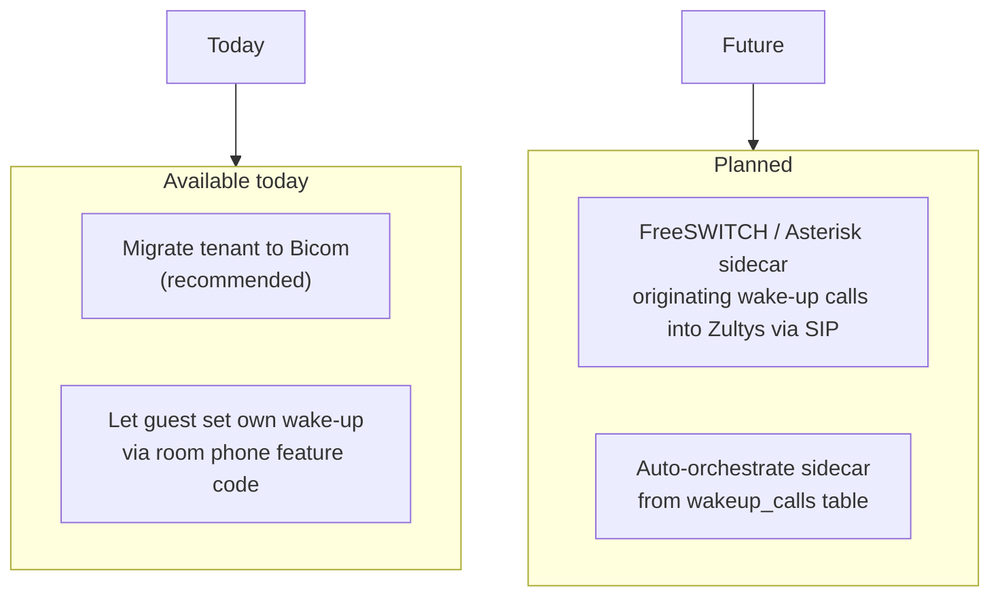

# Future Considerations

This document outlines features and enhancements for future development phases.

---

## Security & Access Control

### IP Whitelisting / ACLs

For connecting to external port-forwarded PMS servers:

```yaml
tenants:
  - id: hotel-alpha
    pms:
      host: pms.customer.com
      port: 3722
      # Future: Bind outbound connections to specific source IP
      source_ip: "203.0.113.10"
      # Future: Allowed destination IPs (validation)
      allowed_ips:
        - "198.51.100.0/24"
```

**Use Cases:**
- Customer firewall rules require known egress IPs
- Validate PMS server hasn't moved unexpectedly
- Multi-homed servers with specific routing needs

### TLS / mTLS Support

For secure PMS connections:

```yaml
pms:
  tls:
    enabled: true
    cert_file: /certs/client.crt
    key_file: /certs/client.key
    ca_file: /certs/ca.crt
    skip_verify: false  # Never in production
```

---

## Cloud PMS Integration

### Customer Identification Methods

For cloud-based PMS systems that serve multiple customers:

| Method | Config | Description |
|--------|--------|-------------|
| **API Token** | `auth_token` | Bearer token in requests |
| **API Key Header** | `api_key` | Custom header authentication |
| **TLS Client Cert** | `tls.cert_file` | mTLS identity |
| **Customer ID Header** | `customer_id` | `X-Customer-ID` header |
| **Static Egress IP** | (infrastructure) | Customer whitelists our IP |

```yaml
pms:
  protocol: fias-cloud
  host: pms.cloudvendor.com
  port: 443
  auth:
    type: bearer
    token: "${PMS_API_TOKEN}"
  customer_id: "hotel-alpha-12345"
```

### Multi-Region Deployment

```yaml
regions:
  - id: us-east
    egress_ip: "203.0.113.10"
    tenants: ["hotel-east-1", "hotel-east-2"]
  - id: eu-west
    egress_ip: "198.51.100.20"
    tenants: ["hotel-europe-1"]
```

---

## Reliability Enhancements

### Connection Retry with Backoff

```yaml
pms:
  retry:
    max_attempts: 10
    initial_delay: 1s
    max_delay: 5m
    backoff_factor: 2.0
```

### Health Monitoring

- **Per-tenant health status** in `/health` endpoint
- **Alerting integration** via webhook
- **Circuit breaker** for failing PMS connections

### Failover

```yaml
pms:
  primary:
    host: pms.primary.com
    port: 3722
  failover:
    host: pms.backup.com
    port: 3722
  failover_threshold: 3  # failures before switch
```

---

## Compliance & Audit

### Data Retention Policies

```yaml
retention:
  pms_events: 90d      # Keep event logs for 90 days
  guest_sessions: 1y   # Keep session history for 1 year
  audit_logs: 7y       # GDPR/compliance retention
```

### PII Handling

- **Guest name masking** in logs (configurable)
- **Data export** for GDPR requests
- **Automated purge** after retention period

---

## Additional Protocol Support

### PMS Protocol Status

| Protocol | Status | Tier | Notes |
|----------|--------|------|-------|
| **Mitel SX-200** | ✅ | shipped | Connect + listen modes |
| **Oracle FIAS / Fidelio** | ✅ | shipped | Connect + listen modes |
| **TigerTMS iLink** | ✅ | shipped (Tier 0 wake-up fix) | COS/DDI round-out is Tier 2 |
| **ASIP** | 📋 | Tier 3 | Reuses `fias/` parser with different LR record set |
| **HTNG** | 📋 | Tier 3+ | Vendor-neutral, JSON over HTTPS, needs a real parser |
| **Mews** | 📋 | Tier 3 | REST + webhooks, OAuth/API key |
| **Cloudbeds** | 📋 | Tier 3 | REST + webhooks, OAuth |
| **Hilton PEP** | ❌ | on request | FIAS-flavored |
| **Hyatt HIS** | ❌ | on request | FIAS-flavored |
| **Marriott FOSSE** | ❌ | on request | Closed, FIAS-shaped |

### Wake-Up Call Enhancements

- ✅ **State toggle (Tier 0)** — `pbxware.ext.es.opwakeupcall.set` toggles
  whether the extension has a wake-up scheduled. Bicom only accepts a
  `state` parameter; the actual time is held by the PBX.
- ✅ **ARI Originate at scheduled time (Tier 1)** — `WakeUpScheduler`
  fires the call via `ari.Client.Channel().Originate` to the extension
  using a `wakeup` Stasis app.
- 📋 **IVR confirmation** — Tier 2/3: add a Stasis app that prompts
  "press 1 to confirm" before hanging up.
- 📋 **Retry logic** — Tier 2: if the line is busy / no-answer, retry
  after N minutes.
- 📋 **PMS callback** — Tier 4: outbound webhook fires `wakeup_completed`
  / `wakeup_failed` events back to the PMS.

### Zultys Wake-Up Path (currently loud-fail)

Zultys does not provide a native wake-up call API. ScheduleWakeUpCall /
OriginateWakeUp on the Zultys provider returns `ErrWakeUpNotSupported`
and increments `hospitality_pbx_wakeup_unsupported_total`. The current
remediation paths are:



The wakeup_calls table is already the source of truth — a sidecar
implementation only needs to watch the table and originate SIP calls
into the Zultys. No service-side changes are needed.

---

## API Enhancements

### Webhook Notifications

```yaml
webhooks:
  - url: https://customer.com/hospitality/events
    secret: "${WEBHOOK_SECRET}"
    events: ["checkin", "checkout", "wakeup_completed"]
```

### Rate Limiting

```yaml
api:
  rate_limit:
    requests_per_minute: 100
    burst: 20
```

### API Authentication

```yaml
api:
  auth:
    type: api_key  # or "oauth2", "basic"
    keys:
      - id: admin-key
        secret: "${ADMIN_API_KEY}"
        scopes: ["read", "write", "admin"]
```

---

## Scalability

### Horizontal Scaling

- **Tenant sharding** - Distribute tenants across instances
- **Leader election** - Only one instance handles each PMS connection
- **Redis coordination** - For distributed state

### Database Optimization

- **Connection pooling tuning** - Per-load adjustment
- **Read replicas** - For reporting/events queries
- **Partitioning** - `pms_events` table by date

---

## Monitoring Enhancements

### Grafana Dashboard

- PMS connection status per tenant
- Event processing rate and latency
- Error rates by type
- Guest session counts

### Alerting Rules

| Alert | Condition | Severity |
|-------|-----------|----------|
| PMS Disconnected | `pms_connection_status == 0` for 5m | Critical |
| High Error Rate | `rate(errors) > 10/min` | Warning |
| Event Backlog | Unprocessed events > 100 | Warning |

---

## Implementation Priority

Status reflects the work completed in [ROADMAP.md](../ROADMAP.md) Tier 0
and Tier 1 (2026-07). For active TODOs, see `ROADMAP.md` §3+.

| Feature | Status | Priority | Effort | Notes |
|---------|--------|----------|--------|-------|
| TigerTMS Implementation | ✅ done | — | — | Tier 0 wake-up fix; Tier 2 round-out next |
| WakeUpScheduler + ARI originate | ✅ done | — | — | Tier 1 — see `internal/wakeup` |
| Bicom wake-up via `opwakeupcall.set` | ✅ done | — | — | Tier 0 |
| Zultys wake-up loud-fail + counter | ✅ done | — | — | Tier 0 |
| `/admin/tenants/{id}/capabilities` | ✅ done | — | — | Tier 0 |
| Mitel `WAK` parser | 📋 TODO | high | low | Tier 2 |
| TigerTMS COS / DDI / reservation_id | 📋 TODO | high | medium | Tier 2 |
| Dynamic extension provisioning | 📋 TODO | high | medium | Use existing `pbxware.ext.add` |
| Tenant reconnect supervisor | 📋 TODO | high | medium | Reliability win |
| `pbx.Manager` ↔ `tenant.Manager` reconcile | 📋 TODO | medium | medium | Two parallel PBX models |
| Outbound webhooks (hospitality → PMS) | 📋 TODO | medium | medium | Tier 4 |
| ASIP / Mews / Cloudbeds adapters | 📋 TODO | medium | high | Tier 3 |
| FreeSWITCH sidecar for Zultys wake-up | 📋 TODO | low | high | Operational, not code |
| IP Whitelisting | 📋 TODO | medium | low | Customer request driven |
| Cloud PMS Auth (OAuth2, etc.) | 📋 TODO | high | medium | Needed for SaaS vendors |
| TLS / mTLS for PMS connections | 📋 TODO | high | medium | Security requirement |
| HTNG adapter | 📋 TODO | low | high | Per-customer need |
| Hilton PEP / Hyatt HIS / Marriott FOSSE | 📋 TODO | low | high | Closed, partner-specific |
