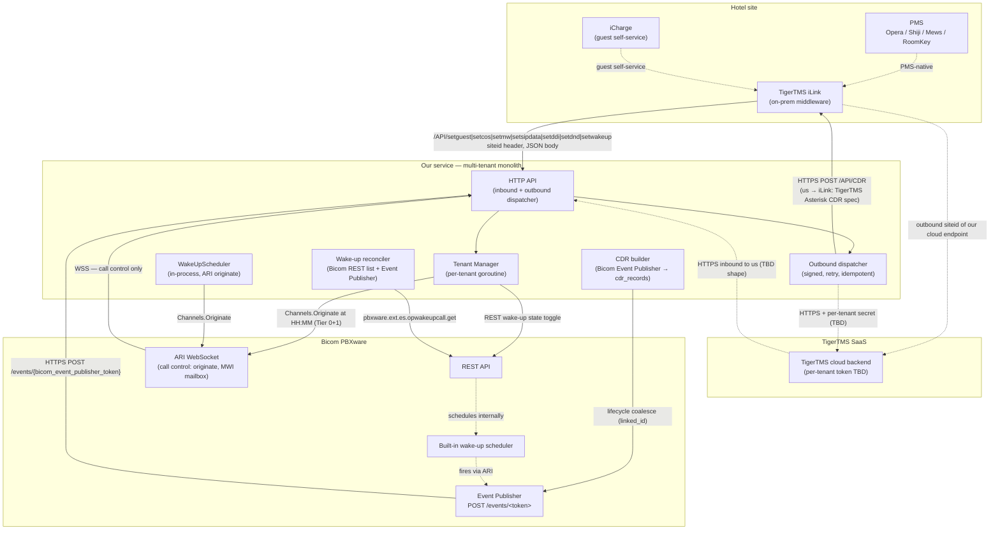
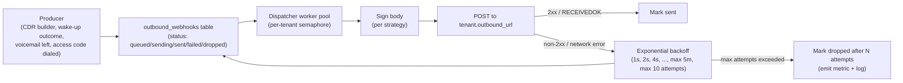
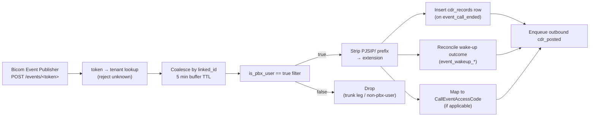
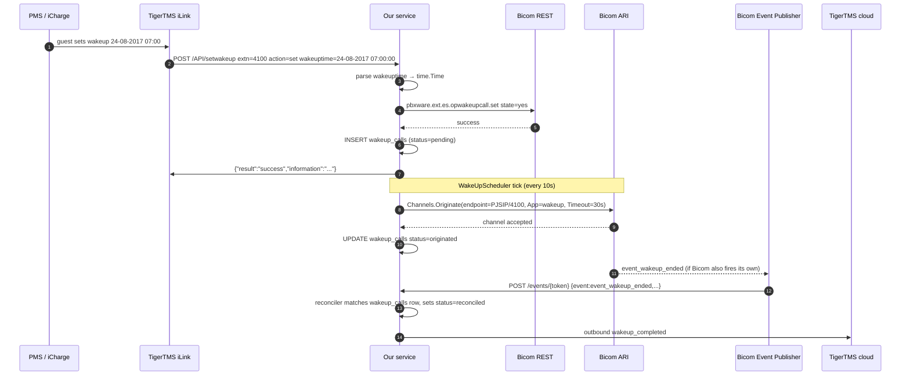
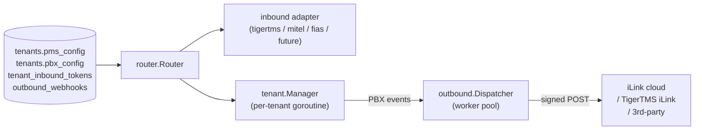

# TigerTMS Cloud Backend + iLink Integration — Architecture & Gap Doc

> **Status: design draft, Tier 0 for the TigerTMS tenant class.**
> Documents the target shape of the integration between our hospitality
> service, TigerTMS iLink + iCharge (on-prem at the hotel), the
> TigerTMS cloud backend (vendor SaaS), and Bicom PBX. Lists what
> exists, what needs to change, what's new, and what remains open.

> **Companion doc:** [./tigertms-ilink-protocol.md](./tigertms-ilink-protocol.md)
> is the verbatim wire-format spec extracted from the PDFs that ship
> in this repo (`docs/tigertms/TigerTMS_AsteriskRestAPI.pdf` and
> `docs/tigertms/TigerTMS_AsteriskPostCDRRestAPI.pdf`). Read that first
> if you are implementing the iLink endpoints.

---

## 1. Topology



**Multi-tenanted monolith.** Each tenant is a goroutine in our single
process (see `tenant/manager.go:541-545`). Strong enough isolation for
hundreds of tenants. Tenant-sharded pod-per-tenant is a future option.

---

## 2. Critical gap: existing TigerTMS handler does not match iLink protocol

**The `internal/pms/tigertms/tigertms.go` handler is incorrect for
the real TigerTMS iLink protocol** documented in the included PDFs.
Mismatches:

| Aspect | Current handler | Real iLink protocol (from PDFs) |
|---|---|---|
| Auth | `Authorization: Bearer {token}` (`tigertms.go:120-132`) | HTTP header `siteid: <id>` |
| Body encoding | `application/x-www-form-urlencoded` (`c.FormValue(...)`) | `application/json` (`text/json` per PDF) |
| Field for room | `room` | `extn` (extension, not room — extension↔room lookup is our job) |
| Check-in/out field | `checkin=true/false` boolean | `status: "occupied" / "vacant"` |
| Guest name fields | Single `guest` string | `firstname` + `lastname` + `title` (separate fields) |
| Wake-up time format | `HH:MM` (e.g. `07:30`) | `dd-mm-yyyy hh:mm:ss` (e.g. `24-08-2017 08:00:00`) |
| Wake-up actions | `enabled=true/false` only | `set` / `clear` / `clearall` (clearall is bulk cancel) |
| `setguest` response | `{"success":true,"message":"..."}` | `{"result":"success","information":"..."}` / `{"result":"failed","information":"..."}` |
| CDR direction | Inbound to us at `/API/CDR` | **Outbound from us** (we POST CDRs to iLink) |
| CDR response | `{"success":true,...}` | `{"response":"RECEIVEDOK"}` / `{"response":"ERROR"}` |
| `setsipdata` semantics | `name` + `callerid` (display) | `sippassword` (iConnect BYOD credential) |
| DDI | `ddi` value only | `ddi` + `operation: "set" / "clear"` |
| COS | `cos` value only | `cos` value (matches) |
| DND | `dnd=true/false` | `dnd: "on" / "off"` |
| MWI | `mw=true/false` | `mw: "on" / "off"` |
| Auto-clear on vacant | Not implemented | iLink spec says clear MWI/DDI/DND on vacant — iLink does this server-side |

**Resolution path:** rewrite the handler to match the PDFs (see
[Implementation Tiers](#implementation-tiers) Tier G). Keep the
existing event shapes (`pms.EventCheckIn`, `pms.EventMessageWaiting`,
etc.) — only the wire deserialization and outbound CDR layer change.

---

## 3. Multi-tenant model

### 3.1 Process isolation (✓ already in place)

- Per-tenant goroutine in `tenant/manager.go:541-545`.
- Per-tenant config (`pms_config`, `pbx_config`, `settings`) in DB.
- Shared DB pool — a single tenant cannot starve the DB connection
  budget because we already cap the DB pool in `internal/db/db.go`.

### 3.2 Siteid header (the actual multi-tenant discriminator)

Per the iLink PDF, multi-tenanted iLink deployments use the `siteid`
HTTP header to discriminate tenants — **not** URL tokens or path
prefixes. Our handler must:

1. Read `siteid` header.
2. Look up the tenant whose `pms_config.siteid` matches.
3. Apply tenant-scoped secrets, mapper, and PBX provider.

> **Implication for our schema:** each tenant's `pms_config` JSONB
> needs a `siteid` field. The path-prefix routing in `api.go:163`
> (`app.Post("/tigertms/:tenant/API/*", ...)`) is wrong for real iLink.

### 3.3 PBX-side isolation

Decision: **one `BicomSystem` row can host multiple ARI credentials,
each scoped to one or more tenants.** Modeled as a new mapping table
(see §4).

---

## 4. PBX connection shape (per-bicom-system with tenant scoping)

Decision: **shared `bicom_systems` row + per-tenant ARI credentials.**

**New table: `bicom_system_ari_credentials`**

| Column | Type | Notes |
|---|---|---|
| `id` | uuid PK | |
| `bicom_system_id` | FK → `bicom_systems.id` | Which Bicom box |
| `tenant_id` | FK → `tenants.id` nullable | Which tenant this credential belongs to (NULL = shared) |
| `ari_user` | string | ARI login |
| `ari_pass_encrypted` / `ari_pass_nonce` | bytes | AES-256-GCM (same vault as `bicom_systems.ari_pass_*`) |
| `ari_app_name` | string | Stasis app name (e.g. `hospitality-tenant-alpha`) |
| `tenant_filter` | string[] / jsonb | Extensions / tenantcodes this credential may receive events for |
| `enabled` | bool | |
| `created_at` / `updated_at` | timestamptz | |

Reconciliation with existing `sites` + `site_bicom_mappings`:

- `sites` + `site_bicom_mappings` = **failover / priority** layer
  (which Bicom box is primary for which site).
- `bicom_system_ari_credentials` = **per-tenant ARI identity** layer
  (which ARI credential to use for a given (tenant, bicom_system) pair).

The two compose: tenant.Manager resolves "what Bicom systems should
this tenant route to?" via the site mapping, then picks an ARI
credential per system.

---

## 5. Inbound channels

| Channel | Endpoint | Auth | Source | Status |
|---|---|---|---|---|
| **TigerTMS iLink (on-prem)** | `POST /api/v1/pms/ilink/API/*` | `siteid` HTTP header | iLink at the hotel | **rewrite needed** — see §2 |
| **TigerTMS cloud backend** | `POST /api/v1/pms/cloud/{tenant}/...` (path TBD) | TBD (bearer / HMAC / URL-token — see [open questions](#open-questions--unresolved-gaps)) | TigerTMS SaaS | **new** |
| **Bicom ARI WebSocket** | `wss://{host}:8088/ari/events` | ARI basic auth | Bicom | **exists** — narrows scope to call control only |
| **Bicom Event Publisher** | `POST /events/{bicom_event_publisher_token}` | URL token (≥128 bits entropy) | Bicom | **new** — see §7 |
| **Mitel / FIAS via iLink** | iLink mediates | n/a | PMS | iLink's job, not ours |

### 5.1 Inbound iLink — needed changes

Rewrite `internal/pms/tigertms/` to:

1. Drop bearer-token middleware. Read `siteid` header. Look up
   tenant.
2. Parse JSON body, not `application/x-www-form-urlencoded`.
3. Map iLink fields to `pms.Event` (see
   [tigertms-ilink-protocol.md §5](./tigertms-ilink-protocol.md#mapping-to-our-internal-model)).
4. On `status: vacant`, also emit `EventRoomStatus` with
   `evt.Metadata["ilink_clear"] = "true"` so our `tenant.handleCheckOut`
   knows to clear MWI/DDI/DND even if the explicit event hasn't
   arrived yet (defense-in-depth: iLink spec says iLink clears these
   server-side, but the Bicom state still needs to be touched).
5. Preserve iCharge source: tag `evt.Metadata["source"]` ∈
   `{pms, icharge, tigertms_cloud}` based on whatever hint iLink
   provides (today iLink doesn't expose this — see open questions).
6. Handle `action: clearall` on `/API/setwakeup` — bulk-cancel all
   `wakeup_calls` rows for the extension and clear the Bicom state
   for all of them.

---

## 6. Outbound channels (the BIG new piece)

### 6.1 Outbound to TigerTMS iLink — CDR push

**`POST {iLink_base_url}/API/CDR`** with body shape from
[tigertms-ilink-protocol.md §4](./tigertms-ilink-protocol.md#cdr-endpoint-us--tigertms).

| Concern | Value |
|---|---|
| Auth | `siteid` HTTP header (same as inbound — but a *different* value, the iLink-issued siteid for our outbound role) |
| Body | JSON, top-level key `message`, Asterisk CDR field names |
| Response | `{"response":"RECEIVEDOK"}` / `{"response":"ERROR"}` |
| Retry | 3 attempts, then dump + log |
| Buffer | Required — iLink says "if the service is not running, buffer locally and retry when the link re-establishes" |

### 6.2 Outbound to TigerTMS cloud backend — events

For cloud-backend tenants (where iLink isn't on-prem, TigerTMS cloud
talks to us directly), we POST events instead of CDRs:

| Event | Payload |
|---|---|
| `cdr_posted` | Same as iLink CDR shape, plus our wrapper |
| `wakeup_completed` | `{tenant_id, extn, wakeuptime, completed_at, source}` |
| `wakeup_failed` | `{tenant_id, extn, wakeuptime, error, source}` |
| `wakeup_reconciled` | `{tenant_id, extn, bicom_confirmed, ours_confirmed, divergence}` |
| `voicemail_left` | `{tenant_id, extn, caller_id, caller_name, mailbox_at}` |
| `access_code_dialed` | `{tenant_id, extn, code, meaning}` |

Auth strategy is **pluggable** — first tenant dictates (see open
questions). We support bearer, HMAC-SHA256, and URL-token out of the
box.

### 6.3 Dispatcher architecture



**Per-tenant rate limiting:** one slow receiver shouldn't starve
others. Each tenant gets a semaphore (default 10 concurrent in-flight
requests).

**Bounded retry for CDR:** the iLink spec is 3 attempts. The CDR
producer uses 3; other event types use the exponential backoff above.

### 6.4 New table: `outbound_webhooks`

| Column | Type | Notes |
|---|---|---|
| `id` | bigserial PK | |
| `tenant_id` | FK → `tenants.id` | |
| `event_type` | string | `cdr_posted`, `wakeup_completed`, `wakeup_failed`, `wakeup_reconciled`, `voicemail_left`, `access_code_dialed` |
| `idempotency_key` | string | dedupe key — `(tenant_id, event_type, source_id)` |
| `payload` | jsonb | normalized body |
| `target_url` | string | per-tenant outbound endpoint |
| `target_strategy` | enum | `i_link_cdr` / `cloud_hmac` / `cloud_bearer` / `cloud_url_token` |
| `status` | enum | `queued` / `sending` / `sent` / `failed` / `dropped` |
| `attempt_count` | int | |
| `last_error` | text | |
| `next_attempt_at` | timestamptz | backoff schedule |
| `delivered_at` | timestamptz nullable | when receiver ACKed |
| `created_at` / `updated_at` | timestamptz | |

Unique on `(tenant_id, event_type, idempotency_key)` to dedupe
double-produces.

---

## 7. Bicom Event Publisher receiver (new)

Receiver contract follows the spec the user provided (mirrors TOPS
PBXware Event Publisher implementation):

| Field | Our value |
|---|---|
| Method | `POST` only — return 405 otherwise |
| Path | `/events/{bicom_event_publisher_token}` mounted per-tenant |
| Auth | Token in URL — stored encrypted in `bicom_systems.event_publisher_token_encrypted/_nonce` |
| Body limit | 1 MiB (`http.MaxBytesReader`) |
| Response | `202 Accepted` with body `"accepted\n"` on success, `"skipped\n"` on filtered-out leg |
| Errors | `400` body parse fail, `404` unknown token, `405` wrong method |

**Pipeline:**



**New table: `cdr_records`**

| Column | Type | Notes |
|---|---|---|
| `id` | bigserial PK | |
| `tenant_id` | FK → `tenants.id` | |
| `bicom_system_id` | FK | which PBX |
| `linked_id` | string | PBXware correlation |
| `event_type` | string | `event_call_started` / `event_call_updated` / `event_call_ended` |
| `extension` | string | normalized (no `PJSIP/` prefix) |
| `direction` | enum | `inbound` / `outbound` |
| `caller` / `callee` | string | normalized |
| `started_at` / `ended_at` | timestamptz | coalesced |
| `duration_sec` | int | coalesced |
| `trunk` | string | |
| `agent_email` / `agent_name` | string | from `queue_agent_info` / `erg_ext_info` |
| `raw_payload` | jsonb | full PBXware payload for debugging |
| `created_at` | timestamptz | default `NOW()` |
| Unique | `(tenant_id, linked_id, event_type)` | dedupe PBXware retries |

---

## 8. Wake-up model C — dual-path with reconciliation

Decision: **keep our ARI originate pipeline as Tier 0, add a
reconciler that observes Bicom's built-in wake-up scheduler via
Event Publisher and REST polling.**



- Our pipeline (state toggle + ARI originate) remains Tier 0 — proven
  path, Bicom REST limitations force this model.
- Reconciler (new) observes Bicom's wake-up events and cross-checks
  against `wakeup_calls`. If our ARI originate succeeded but Bicom
  didn't confirm (or vice versa), emit a `wakeup_reconciled` event
  with `divergence: true` so ops can investigate.
- Reconciler also calls `pbxware.ext.es.opwakeupcall.get` periodically
  (every 60s) to enumerate "what does Bicom think is currently
  scheduled?" and persist a per-extension snapshot (with `known_until`
  expiry, cleared on checkout) — answers "is room 101 still expecting
  a wake-up at 07:00?" without synchronous API calls.

---

## 9. ARI usage split

| Use | Channel | Why |
|---|---|---|
| **Outbound call control** (originate wake-up, set MWI mailbox) | ARI `Channels.Originate`, `Mailbox().Update()` | ARI is the only path on Bicom |
| **Call event stream** (call started/ended, access codes dialed, voicemail deposits, wake-up lifecycle) | Bicom Event Publisher (`/events/<token>`) | Push model, simpler ops, no per-tenant ARI app slot exhaustion |
| **Reconciliation** (periodic fetch of Bicom's wake-up state list) | Bicom REST (`pbxware.ext.es.opwakeupcall.get`) | Pull model for audit / drift detection |

The existing `internal/pbx/bicom` ARI subscription stays — but its
scope narrows to **call control responses** (originate results,
channel hangup on originated wake-up legs), not lifecycle events for
every call.

---

## 10. Configuration additions

### 10.1 `tenants.pms_config` (JSONB) — additions

```jsonc
{
  "protocol": "tigertms_ilink",          // or "tigertms_cloud" — new
  "siteid": "00200",                      // iLink siteid header value (inbound; legacy)
  "outbound_enabled": true,
  "outbound_url": "https://api.tigertms.com/v1/tenants/<id>/hospitality/inbound",
  "outbound_strategy": "hmac_sha256",     // or "bearer" / "url_token" / "ilink_cdr"
  "outbound_secret_ref": "encrypted_secrets:tigertms_cloud_hmac",
  "outbound_events": ["cdr_posted", "wakeup_completed", "wakeup_failed",
                      "voicemail_left", "access_code_dialed", "wakeup_reconciled"]
}
```

### 10.2 Inbound tokens (new table: `tenant_inbound_tokens`)

Multi-tenanted inbound auth credentials. SHA-256 hashes only —
plaintext is never persisted. Managed via the admin API:

| Endpoint | Use |
|---|---|
| `POST /admin/tenants/{id}/tokens` | Create. Returns plaintext exactly once. Body: `{auth_strategy, bearer_secret?, basic_user?, basic_secret?}`. |
| `GET /admin/tenants/{id}/tokens` | List (no secrets, no hashes). |
| `DELETE /admin/tenants/{id}/tokens/{tokenId}` | Disable (revoke). Row stays for audit. |

```sql
CREATE TABLE tenant_inbound_tokens (
    id              BIGSERIAL PRIMARY KEY,
    tenant_id       VARCHAR(64) NOT NULL REFERENCES tenants(id),
    token_hash      VARCHAR(128) NOT NULL, -- SHA-256 hex of inbound URL token
    auth_strategy   VARCHAR(16)  NOT NULL DEFAULT 'url_token',  -- 'url_token' | 'bearer' | 'basic'
    bearer_hash     VARCHAR(128),           -- SHA-256 hex of bearer secret (strategy='bearer')
    basic_user      VARCHAR(64),            -- (strategy='basic')
    basic_hash      VARCHAR(128),           -- SHA-256 hex of basic password (strategy='basic')
    enabled         BOOLEAN DEFAULT TRUE,
    last_used_at    TIMESTAMPTZ,
    created_at      TIMESTAMPTZ NOT NULL DEFAULT NOW(),
    updated_at      TIMESTAMPTZ
);
CREATE UNIQUE INDEX idx_inbound_tokens_tenant_hash ON tenant_inbound_tokens(tenant_id, token_hash);
CREATE INDEX idx_inbound_tokens_enabled ON tenant_inbound_tokens(enabled);
```

> **Migration**: existing `pms_config.auth_token` (plaintext bearer)
> is no longer consulted by the iLink handler — it was incorrect
> for the iLink protocol and the new `tenant_inbound_tokens` table
> supersedes it. Operators generate a fresh token via the admin API
> and configure iLink with the new URL.

### 10.3 `bicom_systems` (table) — additions

```sql
ALTER TABLE bicom_systems ADD COLUMN event_publisher_token_encrypted BYTEA;
ALTER TABLE bicom_systems ADD COLUMN event_publisher_token_nonce    BYTEA;
ALTER TABLE bicom_systems ADD COLUMN event_publisher_enabled        BOOLEAN DEFAULT FALSE;
```

### 10.4 `encrypted_secrets` (existing table) — new `key_name` entries

| `key_name` | Use |
|---|---|
| `tigertms_ilink_siteid` | per-tenant iLink siteid (inbound) |
| `tigertms_cloud_outbound_hmac` | per-tenant HMAC secret for cloud outbound |
| `tigertms_cloud_outbound_bearer` | per-tenant bearer for cloud outbound |
| `bicom_event_publisher_token` | per-Bicom-system URL token |

---

## 11. Implementation tiers

| Tier | Scope | Depends on | Status |
|---|---|---|---|
| **A** — receiver plumbing | `POST /events/{bicom_event_publisher_token}` endpoint, token→tenant lookup, lifecycle coalesce, `cdr_records` table. Pure Bicom-side, no TigerTMS dependency. | — | 📋 TODO |
| **B** — outbound dispatcher core | `outbound_webhooks` table + dispatcher worker + signing + retry + idempotency + per-tenant semaphore. Pluggable auth strategy (bearer / HMAC / URL-token). | A | ✅ **DONE** — `internal/outbound`, `internal/outbound/outboundtest`. Strategies: `ilink_cdr`, `cloud_hmac`, `cloud_bearer`. |
| **C** — TigerTMS iLink inbound | URL-token-based inbound with pluggable auth (url_token / bearer / basic); JSON body, `extn` field, full datetime wake-up, `clearall`. Token lifecycle via admin API. | — | ✅ **DONE** — `internal/pms/tigertms`, `internal/api/admin_tokens.go`, `internal/api/token_resolver.go` |
| **D** — TigerTMS cloud outbound | Per-tenant outbound URL + auth strategy + events_to_emit. CDR producer wired through router. | B, C | 🟡 partial — schema + dispatcher done; producer needs Bicom-side source events (Tier A) |
| **E** — wake-up reconciler | Periodic `pbxware.ext.es.opwakeupcall.get` per tenant → snapshot table; Event Publisher wake-up event handler; divergence alert; outbound `wakeup_reconciled`. | A, B | 📋 TODO |
| **F** — access-code detection + outbound | ARI `StasisStart` extractor upgrade to emit `CallEventAccessCode`; outbound `access_code_dialed`; admin CRUD for access-code → event-type mapping. | A, B | 📋 TODO |
| **G** — multi-bicom ARI credentials | `bicom_system_ari_credentials` table; reconcile with `tenant.Manager` JSONB config; deprecate the plaintext JSONB fallback for PBX connection settings. | — | 📋 TODO |
| **H** — inbound /API/CDR deprecation | Remove the inbound `/API/CDR` handler. | C | ✅ **DONE** as part of Tier C — `handleCDR` no longer exists in `tigertms.go` |
| **I** — event router + per-tenant swap | `internal/router` — per-tenant pipeline that decouples inbound source from outbound sink. Swap tenants between providers via config change. | B, C | ✅ **DONE** — `internal/router` |
| **J** — CDR poller | `bicom.CDRPoller` — polls `pbxware.cdr.list` and emits CDR-shaped events to the router. | A, B, I | 🟡 partial — poller implemented, wiring into tenant pipeline is a small follow-on |

---

## 12. Open questions / unresolved gaps

1. **TigerTMS cloud → us authentication strategy.** TigerTMS does
   not publish the cloud-backend protocol. Pluggable dispatcher
   strategy (bearer / HMAC / URL-token) lets us defer. First tenant
   dictates. Recommendation: **HMAC-SHA256** of body with per-tenant
   secret (symmetric with our outbound), `X-Signature: sha256=...`
   header.
2. **Whether Bicom Event Publisher emits `event_wakeup_*` events.**
   The user-supplied spec covers `event_call_*` only. Need to confirm
   with Bicom — if missing, reconciler falls back to REST polling
   only.
3. **Single Event Publisher token per Bicom box, or per tenant?**
   The spec implies one token per receiver. If one token per box,
   multiple tenants on the same box share that token; we tenant-scope
   by `token → bicom_systems.id → bicom_system_ari_credentials` filter.
4. **iCharge vs PMS source tagging.** iLink forwards iCharge events
   through the same wire format but does not currently expose the
   source. Need to either ask iLink to add a header/field, or infer
   from event timing/contents.
5. **CDR retention.** Default 1 year? Compliance driven. ROADMAP §6
   mentions retention but no number. The `outbound_webhooks` table
   has no built-in retention; rows accumulate forever unless
   explicitly pruned.
6. ~~Migration of existing inbound `pms_config.auth_token` plaintext~~
   **RESOLVED** — the old `auth_token` field is no longer used by the
   iLink handler. Tokens live in `tenant_inbound_tokens` with
   SHA-256 hashes. The legacy plaintext field is still readable for
   backward compat but is no longer consulted at request time.
7. **Reconcile `pbx.Manager` ↔ `tenant.Manager` (ROADMAP §3).** Still
   open — `tenant.Manager` creates its own provider from JSONB and
   doesn't use `pbx.Manager`. Tier G follow-on.
8. **Outbound rate limiting per tenant** — default 10 concurrent
   in-flight requests, configurable per tenant. Currently the
   dispatcher uses a single semaphore shared across all tenants.
   Per-tenant semaphores are a small follow-on.
9. **iConnect BYOD.** iLink allocates 3-4 extra extensions per room
   for guest mobiles via `/API/setsipdata` with `sippassword`. Our
   Bicom provider doesn't currently rotate extension passwords on
   check-in/out — gap. Tier F+ feature work on `pbxware.ext.edit`.
10. **`setguest` vacant auto-clear conflict.** iLink clears MWI/DDI/DND
    server-side when `status: vacant`. Our handler emits
    `EventCheckOut` with `ilink_clear=true` metadata so
    `tenant.handleCheckOut` does the same on Bicom. Double-clear is
    idempotent on Bicom today.

---

## 13. Dynamic pipeline — tenant swap via config

The `internal/router` package is the dynamic pipeline. Each tenant's
end-to-end flow is described entirely by configuration: inbound
protocol + URL token, outbound URL + strategy + auth. To swap a
tenant between systems (e.g. on-prem iLink → iLink cloud, or Bicom
→ Zultys), change the tenant's `pms_config` / `pbx_config` and the
router reloads — no code change.



- **Swap tenant from on-prem iLink to iLink cloud:** revoke old
  `tenant_inbound_tokens` row, create new one with the cloud
  endpoint URL. Outbound config in `pms_config.outbound_url` switches
  to the cloud receiver. No code change.
- **Swap tenant from Bicom to Zultys:** update `pbx_config.type`,
  rebuild `pbx.Provider`. Router doesn't care — it only consumes
  `pms.Event` shapes.
- **Add a new PMS type (Mews, Cloudbeds):** implement the
  `pms.Adapter` interface; register in `pms.Registry`; mount a new
  route group with the same URL-token auth pipeline. Router picks
  it up automatically.

---

## 14. References

- [tigertms-ilink-protocol.md](./tigertms-ilink-protocol.md) — wire
  format extracted from the PDFs, plus the URL-token auth model.
- [../tigertms.md](../tigertms.md) — original (incorrect) iLink
  reference; superseded for protocol details, retained for the
  TigerTMS product overview and Tier 0+1 wake-up fix history.
- [../DATA-FLOW.md](../DATA-FLOW.md) — read-order index.
- [../ROADMAP.md](../../ROADMAP.md) §6 — Tier 4 outbound webhooks is
  now Tier 0 for this integration (see change below).
- [../architecture.md](../architecture.md) — system topology.
- [../pbx-providers.md](../pbx-providers.md) — PBX provider surface.