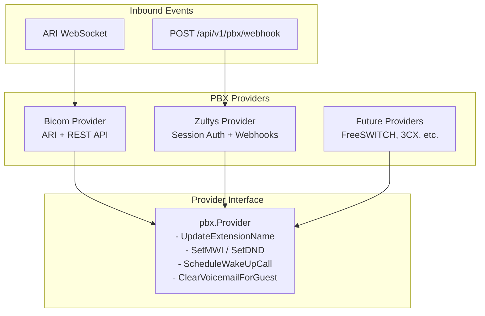

# PBX Providers

This document describes the PBX provider abstraction layer and the supported PBX backends.

## Overview

The hospitality integration supports multiple PBX systems through a provider abstraction layer. Each provider implements a common interface for hospitality operations while handling the specifics of its PBX platform.



---

## Supported Providers

| Provider | Type | Inbound Events | Outbound Commands |
|----------|------|----------------|-------------------|
| **Bicom** | Asterisk-based | ARI WebSocket | REST API + ARI |
| **Zultys** | Webhook-based | HTTP POST | Session-authenticated REST |

---

## Bicom PBXware

Bicom PBXware is the primary PBX backend, using Asterisk's ARI for real-time events and the Bicom REST API for configuration.

### Configuration

```yaml
tenants:
  - id: hotel-alpha
    pbx:
      type: bicom              # Default, can be omitted
      
      # Bicom REST API (for extension/voicemail management)
      api_url: "https://pbx.example.com"
      api_key: "${BICOM_API_KEY}"
      tenant_id: "alpha"
      
      # ARI (for real-time call events and MWI)
      ari_url: "http://pbx:8088/ari"
      ari_ws_url: "ws://pbx:8088/ari/events"
      ari_user: "hospitality"
      ari_pass: "${ARI_SECRET}"
      app_name: "bicom-hospitality"
```

### Features

| Feature | API Used | Notes |
|---------|----------|-------|
| Extension Name | REST API | `pbxware.ext.edit` |
| Voicemail Delete | REST API | `pbxware.vm.delete_all` |
| Voicemail Greeting | REST API | `pbxware.ext.es.vm.edit` |
| MWI | ARI | Mailbox state update |
| DND | REST API | `pbxware.ext.es.dnd.edit` |
| Wake-Up Calls | REST API | `pbxware.ext.es.wakeupcall.edit` |
| Call Forward | REST API | `pbxware.ext.es.callforward.edit` |

See [Bicom API Reference](bicom-api.md) for detailed endpoint documentation.

---

## Zultys

Zultys uses session-based authentication and HTTP webhooks for bidirectional communication.

### Configuration

```yaml
tenants:
  - id: hotel-zultys
    pbx:
      type: zultys
      
      # Outbound API (session-authenticated)
      api_url: "https://zultys.hotel.com/api"
      auth_url: "/auth/login"
      username: "${ZULTYS_USERNAME}"
      password: "${ZULTYS_PASSWORD}"
      
      # Inbound webhook validation
      webhook_secret: "${ZULTYS_WEBHOOK_SECRET}"
```

### Session Authentication

The Zultys provider automatically manages authentication:

1. On first API call, authenticates using `username`/`password`
2. Caches the session token
3. Auto-refreshes on expiry or 401 response
4. Never stores raw admin credentials in API calls

### Inbound Webhooks

Zultys sends call events to: `POST /api/v1/pbx/webhook/{tenant-id}`

**Webhook Payload Format:**
```json
{
  "event": "access_code",
  "extension": "1015",
  "caller_id": "5551234567",
  "caller_name": "Guest Room 1015",
  "access_code": "*411",
  "timestamp": "2026-01-05T14:00:00Z"
}
```

**Supported Events:**
| Event | Description |
|-------|-------------|
| `access_code` | Guest dialed a feature code (*411, etc.) |
| `incoming` | Incoming call to room extension |
| `voicemail_left` | Voicemail message left |
| `call_end` | Call ended |

**Signature Validation:**

If `webhook_secret` is configured, requests must include:
```
X-Webhook-Signature: <HMAC-SHA256 hex digest of body>
```

### Features

| Feature | Endpoint | Status |
|---------|----------|--------|
| Extension Name | POST `/extensions/{ext}/name` | ✅ Supported |
| Voicemail Delete | DELETE `/voicemail/{ext}/messages` | ✅ Supported |
| Voicemail Greeting | POST `/voicemail/{ext}/greeting/reset` | ✅ Supported |
| MWI | POST `/extensions/{ext}/mwi` | ✅ Supported |
| DND | POST `/extensions/{ext}/dnd` | ✅ Supported |
| Call Forward | POST `/extensions/{ext}/forward` | ✅ Supported |
| Wake-Up Calls | N/A | ❌ Not supported |

> **Note:** These are placeholder endpoints. Update with actual Zultys API paths when available.

### Wake-Up Call Limitation

Zultys does not provide a native API for scheduled wake-up calls. For properties requiring wake-up call functionality with Zultys, a future enhancement would involve:

1. **External Call Scheduler** - A FreeSWITCH-based service that stores scheduled wake-up times
2. **At scheduled time** - FreeSWITCH originates a call to the room extension
3. **Playback** - Plays a wake-up announcement or connects to IVR

This is tracked as a future enhancement.

---

## Adding a New Provider

To add support for a new PBX (e.g., FreeSWITCH):

### 1. Create the Provider Package

```
internal/pbx/freeswitch/
├── provider.go    # Main provider implementation
└── api.go         # Optional: API client
```

### 2. Implement the Provider Interface

```go
package freeswitch

import "github.com/sagostin/pbx-hospitality/internal/pbx"

type Provider struct {
    // provider fields
}

// NewProvider creates a new provider
func NewProvider(cfg Config) (*Provider, error) {
    // ...
}

// Implement all pbx.Provider methods
func (p *Provider) Connect(ctx context.Context) error { ... }
func (p *Provider) Close() error { ... }
func (p *Provider) Connected() bool { ... }
func (p *Provider) UpdateExtensionName(ctx context.Context, ext, name string) error { ... }
// ... remaining methods
```

### 3. Register the Provider

```go
func init() {
    pbx.Register("freeswitch", func(cfg pbx.ProviderConfig) (pbx.Provider, error) {
        return NewProvider(Config{
            // map config fields
        })
    })
}
```

### 4. Import in Tenant Manager

```go
// internal/tenant/manager.go
import (
    _ "github.com/sagostin/pbx-hospitality/internal/pbx/freeswitch"
)
```

### 5. Add Config Fields

```go
// internal/config/config.go
type PBXConfig struct {
    // ... existing fields
    
    // FreeSWITCH-specific
    FSHost     string `yaml:"fs_host"`
    FSPassword string `yaml:"fs_password"`
}
```

---

## Provider Interface Reference

```go
type Provider interface {
    // Connection lifecycle
    Connect(ctx context.Context) error
    Close() error
    Connected() bool

    // Extension management
    UpdateExtensionName(ctx context.Context, ext, name string) error

    // Voicemail management
    DeleteAllVoicemails(ctx context.Context, ext string) error
    ResetVoicemailGreeting(ctx context.Context, ext string) error
    ClearVoicemailForGuest(ctx context.Context, ext string) error

    // Message Waiting Indicator
    SetMWI(ctx context.Context, ext string, on bool) error

    // Do Not Disturb
    SetDND(ctx context.Context, ext string, on bool) error

    // Wake-up calls
    ScheduleWakeUpCall(ctx context.Context, ext string, wakeTime time.Time) error
    CancelWakeUpCall(ctx context.Context, ext string) error

    // Call forwarding
    SetCallForward(ctx context.Context, ext, destination string, enabled bool) error
}
```

For providers that receive inbound events:

```go
type EventProvider interface {
    Provider
    Events() <-chan CallEvent
}

type WebhookProvider interface {
    EventProvider
    HandleWebhook(r *http.Request) error
    WebhookSecret() string
}
```
