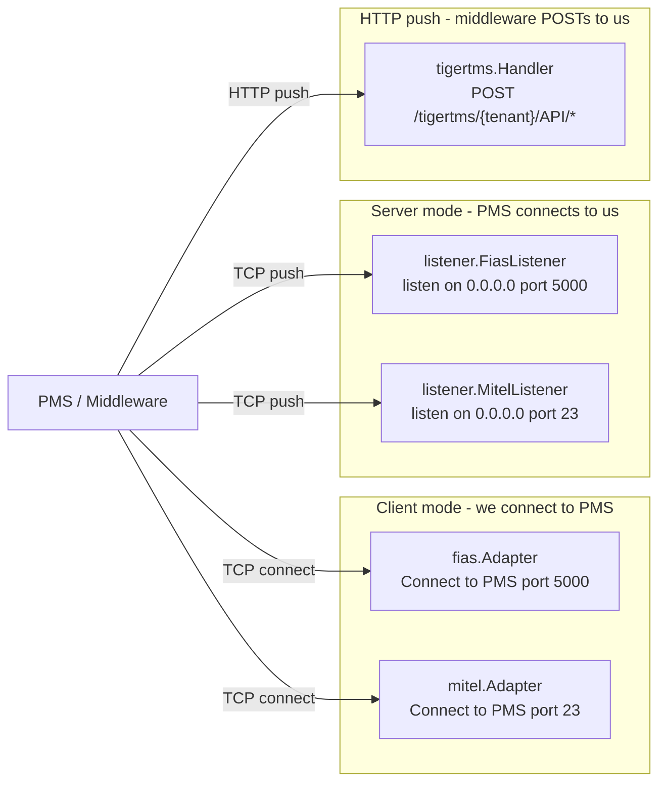

# PMS Protocol Reference

Quick reference for Property Management System protocols supported by the
Bicom Hospitality Integration. The current code lives in
`internal/pms/{fias,mitel,tigertms}` (connect / outbound) and
`internal/pms/listener` (server / inbound).

## Protocol Topology



For how these events flow into the per-tenant event processor and out to the
PBX, see [architecture.md](architecture.md). The wake-up call pipeline (added
in Tier 0/1) is described in [pbx-providers.md](pbx-providers.md).

---

## Mitel SX-200 / MiVoice Protocol

### Framing

| Control | Hex | ASCII | Description |
|---------|-----|-------|-------------|
| STX | `0x02` | `^B` | Start of message |
| ETX | `0x03` | `^C` | End of message |
| ENQ | `0x05` | `^E` | Enquiry (polling) |
| ACK | `0x06` | `^F` | Acknowledged |
| NAK | `0x15` | `^U` | Not acknowledged |

### Message Format

```
<STX><FUNC><STATUS><ROOM_#><ETX>
     │     │       └─ 5 chars, space-padded
     │     └─ 1-2 chars
     └─ 2-3 chars
```

Total payload: 10 characters (after STX, before ETX).

### Function Codes

| Code | Function | Status | Example | Implemented |
|------|----------|--------|---------|-------------|
| `CHK` | Check-In/Out | `1`=in, `0`=out | `CHK1 2129` | ✅ |
| `MW ` | Message Waiting | `1`=on, `0`=off | `MW 1 2129` | ✅ |
| `NAM` | Guest Name | `1`=set | `NAM1 2129` | ✅ |
| `RM ` | Room Status | `1`=occupied | `RM 1 2129` | ✅ |
| `DND` | Do Not Disturb | `1`=on, `0`=off | `DND1 2129` | ✅ |
| `WAK` | Wake-up call (alarm) | varies | `WAK0730` | 📋 Tier 2 |

> **Tier 2 TODO:** Mitel wake-up function code (`WAK`) is not currently
> parsed by the Mitel adapter. PMS vendors vary in how they encode the
> wake-up time inside the function-code payload. Until Tier 2 ships,
> Mitel-driven wake-ups will be silently rejected.

### Examples

**Check-In Room 2129:**
```
Raw:    02 43 48 4B 31 20 32 31 32 39 03
Parsed: <STX>CHK1 2129<ETX>
```

**Message Waiting ON for Room 101:**
```
Raw:    02 4D 57 20 31 20 20 31 30 31 03
Parsed: <STX>MW 1   101<ETX>
```

---

## Oracle FIAS / Fidelio Protocol

### Transport

- TCP/IP connection to FIAS server
- Persistent connection with Link Record handshake
- ASCII text records with field delimiters

### Record Format

```
<RECORD_TYPE>|<FIELD>=<VALUE>|<FIELD>=<VALUE>|...|
```

### Common Record Types

| Type | Description | Direction | Implemented |
|------|-------------|-----------|-------------|
| `LR` | Link Record (handshake) | Bidirectional | ✅ |
| `LS` | Link Start | Bidirectional | ✅ |
| `LA` | Link Alive (keepalive) | Bidirectional | ✅ |
| `LE` | Link End | Bidirectional | ✅ |
| `GI` | Guest Check-In | PMS → PBX | ✅ |
| `GO` | Guest Check-Out | PMS → PBX | ✅ |
| `MW` | Message Waiting | PMS → PBX | ✅ |
| `RS` | Room Status | PBX → PMS | ✅ |
| `WK` | Wake-Up Call | PMS → PBX | ✅ |

### Common Field Types

| Field | Description | Example |
|-------|-------------|---------|
| `RN` | Room Number | `RN1015` |
| `GN` | Guest Name | `GNSmith, John` |
| `DA` | Date (YYMMDD) | `DA260102` |
| `TI` | Time (HHMM) — **also the wake-up time field** | `TI1430` |
| `FL` | Flag | `FL1` |
| `RI` | Reservation ID | `RI12345` |

> The wake-up time from `WK` records is read from `evt.Metadata["TI"]` by
> the tenant manager. The Bicom REST API does not accept a time — the
> service toggles the wake-up state and the in-process
> [WakeUpScheduler](pbx-providers.md#wake-up-call-pipeline) fires the
> actual call via ARI Originate at the scheduled time. See
> [architecture.md#wake-up-call-flow-pms-driven-bicom--ari](architecture.md).

### Examples

**Link Record (capabilities negotiation):**
```
LR|DA|TI|RN|GN|FL|RI|
```

**Guest Check-In:**
```
GI|RN1015|GNSmith, John|DA260102|TI1430|RI12345|
```

**Guest Check-Out:**
```
GO|RN1015|DA260102|TI1100|
```

**Wake-Up Call:**
```
WK|RN1015|TI0700|
```
→ emits `pms.Event{Type: EventWakeUp, Metadata: {"TI":"0700"}}`. The
tenant manager parses `0700` as 07:00 in the tenant timezone and:
1. Calls `pbxware.ext.es.opwakeupcall.set state=yes` on Bicom.
2. Inserts a row into `wakeup_calls` with `scheduled_at = today 07:00`.
3. The WakeUpScheduler fires it via ARI `Channels.Originate` at HH:MM.

---

## TigerTMS iLink REST API

TigerTMS iLink is middleware that translates between PMS systems and PBX via HTTP REST API.

### Transport

- HTTP/HTTPS REST API
- TigerTMS pushes to our endpoints
- Query parameters or JSON body format

### Endpoints

| Endpoint | Description | Implemented | Notes |
|----------|-------------|-------------|-------|
| `/API/setguest` | Guest check-in/out | ✅ | |
| `/API/setcos` | Class of Service | ⚠️ emits event, no consumer | Tier 2 |
| `/API/setmw` | Message Waiting | ✅ | |
| `/API/setsipdata` | SIP extension data | ✅ | |
| `/API/setddi` | DDI/DID assignment | ⚠️ emits event, no consumer | Tier 2 |
| `/API/setdnd` | Do Not Disturb | ✅ | |
| `/API/setwakeup` | Wake-up calls | ✅ Tier 0 fixed | wakeup_time metadata key |
| `/API/CDR` | Call Detail Records | ✅ | logged to pms_events |

> **Tier 0 fix (2026-07):** `setwakeup` previously stored the time in
> `evt.Metadata["wakeup_time"]` while `tenant.handleWakeUp` looked at
> `evt.Metadata["TI"]`. The handler now tries both keys (and
> `TI_RAW`) so the two stay in sync.

### Examples

**Guest Check-In:**
```
POST /API/setguest?room=2129&checkin=true&guest=Smith%2C+John
```

**Wake-Up:**
```
POST /API/setwakeup?room=101&time=07%3A30&enabled=true
```
→ emits `pms.Event{Type: EventWakeUp, Metadata: {"wakeup_time":"07:30", "source":"tigertms"}}`.

**Message Waiting ON:**
```
POST /API/setmw?room=2129&mw=true
```

See [TigerTMS Integration Guide](tigertms.md) for full documentation.

---

## Protocol Comparison

| Feature | Mitel SX-200 | FIAS | TigerTMS |
|---------|--------------|------|----------|
| Transport | Serial/Telnet | TCP/IP | HTTP REST |
| Encoding | Fixed-width ASCII | Pipe-delimited | Query params/JSON |
| Framing | STX/ETX control chars | Record-based | HTTP request |
| Handshake | ENQ/ACK polling | Link Record | Auth header |
| Wake-up time field | `WAK` (Tier 2) | `TI` (HHMM) | `wakeup_time` / `time` form |
| Complexity | Simple | Feature-rich | Modern |
| Our Role | Socket listener | Socket listener | HTTP server |
| Typical PMS | Legacy systems | OPERA, Suite8 | Any via middleware |