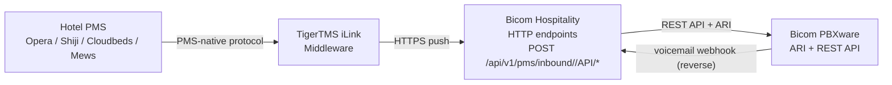

# TigerTMS iLink Integration Guide

> **⚠️ Superseded for wire-format details.**
> The original iLink HTTP REST reference below describes a generic
> TigerTMS-push shape and is **incorrect** for the actual iLink wire
> protocol documented in the PDFs at `docs/tigertms/`. The verified
> protocol — JSON body, `siteid` header, `extn` field, full datetime
> wake-up, `clearall` action, CDR-as-outbound, etc. — is in:
>
> **[`docs/integrations/tigertms-ilink-protocol.md`](integrations/tigertms-ilink-protocol.md)** — wire format extracted from the PDFs.
>
> **[`docs/integrations/tigertms-cloud-backend.md`](integrations/tigertms-cloud-backend.md)** — target architecture, gap analysis, and tier-by-tier implementation plan for the TigerTMS cloud-backend + Bicom integration.
>
> Keep this file for the **product overview**, the **multi-tenanted
> routing** context, the **end-to-end data flow** diagrams, and the
> **Tier 0/1 wake-up fix history** (which still applies). Refer to the
> new docs for endpoint field names, body shapes, and response
> formats.

This document describes integrating TigerTMS iLink middleware with the
Bicom Hospitality PMS Integration service.

---

## Overview

**TigerTMS iLink** is hospitality middleware that acts as a universal translator between Property Management Systems (PMS) and various hotel technology systems including telephony (PBX), TV, Wi-Fi, and guest services.

### Key Characteristics

| Aspect | Details |
|--------|---------|
| **Vendor** | TigerTMS (https://www.tigertms.com) |
| **Product** | iLink Hospitality Middleware |
| **Transport** | HTTP REST API |
| **Direction** | TigerTMS → PBX (push model) |
| **Format** | Query parameters or JSON body |

### How It Differs from Other Protocols

| Protocol | Transport | Direction | Our Role |
|----------|-----------|-----------|----------|
| Mitel SX-200 | TCP Socket | PMS → Us | Socket listener |
| Oracle FIAS | TCP Socket | PMS → Us | Socket listener |
| **TigerTMS** | **HTTP REST** | **Middleware → Us** | **HTTP server** |

With TigerTMS, **we expose HTTP endpoints** that receive events from the middleware, rather than connecting to a PMS socket.

---

## Architecture



TigerTMS iLink:
1. Connects to the hotel's PMS using the PMS-native protocol
2. Translates PMS events to a standardized REST API format
3. Posts events to our HTTP endpoints
4. Optionally receives callbacks for CDR posting

The TigerTMS handler is mounted dynamically at startup for every tenant
whose `pms.protocol` is `tigertms`. See `internal/api/api.go:128-158` for
the route registration.

---

## REST API Endpoints

TigerTMS expects these endpoints to be available on the PBX integration server:

### Guest Check-In / Check-Out

```
POST /API/setguest
```

**Parameters:**

| Field | Type | Description |
|-------|------|-------------|
| `room` | string | Room number |
| `checkin` | boolean | `true` for check-in, `false` for check-out |
| `guest` | string | Guest name (on check-in) |
| `lang` | string | Guest language preference (optional) |

**Example Request:**
```
POST /API/setguest?room=2129&checkin=true&guest=Smith%2C+John
```

**Response:**
```json
{"success": true, "message": "Guest checked in"}
```

---

### Class of Service (COS)

```
POST /API/setcos
```

Controls calling privileges for the room extension.

**Parameters:**

| Field | Type | Description |
|-------|------|-------------|
| `room` | string | Room number |
| `cos` | integer | Class of service level (0-9) |

**COS Levels (typical):**
- `0` = No outbound calls
- `1` = Local calls only
- `2` = National calls
- `3` = International calls

**Example:**
```
POST /API/setcos?room=2129&cos=2
```

---

### Message Waiting Indicator (MWI)

```
POST /API/setmw
```

Controls the message waiting light on room phones.

**Parameters:**

| Field | Type | Description |
|-------|------|-------------|
| `room` | string | Room number |
| `mw` | boolean | `true` = lamp on, `false` = lamp off |

**Example:**
```
POST /API/setmw?room=2129&mw=true
```

---

### SIP Data Update

```
POST /API/setsipdata
```

Updates SIP extension configuration data.

**Parameters:**

| Field | Type | Description |
|-------|------|-------------|
| `room` | string | Room number |
| `callerid` | string | Caller ID to display |
| `name` | string | Extension display name |

**Example:**
```
POST /API/setsipdata?room=2129&name=Smith%2C+John&callerid=2129
```

---

### DDI/DID Assignment

```
POST /API/setddi
```

Assigns or clears a Direct Dial-In number for a room.

**Parameters:**

| Field | Type | Description |
|-------|------|-------------|
| `room` | string | Room number |
| `ddi` | string | DDI number to assign (empty to clear) |

**Example:**
```
POST /API/setddi?room=2129&ddi=+14165551234
```

---

### Do Not Disturb (DND)

```
POST /API/setdnd
```

**Parameters:**

| Field | Type | Description |
|-------|------|-------------|
| `room` | string | Room number |
| `dnd` | boolean | `true` = DND on, `false` = DND off |

**Example:**
```
POST /API/setdnd?room=2129&dnd=true
```

---

### Wake-Up Calls

```
POST /API/setwakeup
```

Schedules or cancels a wake-up call.

**Parameters:**

| Field | Type | Description |
|-------|------|-------------|
| `room` | string | Room number |
| `time` | string | Wake-up time in HH:MM format |
| `enabled` | boolean | `true` to schedule, `false` to cancel |

**Example:**
```
POST /API/setwakeup?room=2129&time=07:00&enabled=true
```

> **Tier 0 (2026-07):** The handler stores the time under metadata key
> `wakeup_time`. The tenant manager reads the time from
> `evt.Metadata["TI"]` first, then falls back to `wakeup_time` and
> `TI_RAW`. Both forms are accepted.

---

### Call Detail Records (CDR)

```
POST /API/CDR
```

Receives CDR from PBX for posting to the PMS billing system.

> **Note:** This endpoint is for **outbound** data from PBX to TigerTMS, used for call billing integration.

**Parameters (JSON body):**

```json
{
  "src": "2129",
  "dst": "+14165551234",
  "start": "2026-01-05T12:30:00Z",
  "duration": 180,
  "billsec": 165,
  "disposition": "ANSWERED"
}
```

See [Asterisk 12 CDR Specification](https://wiki.asterisk.org/wiki/display/AST/Asterisk+12+CDR+Specification) for full field reference.

---

## Configuration

### Tenant Configuration

Add TigerTMS as the PMS protocol in your tenant configuration:

```yaml
tenants:
  - id: hotel-gamma
    name: "Hotel Gamma"
    pms:
      protocol: tigertms_ilink
      # The iLink siteid header discriminates this tenant. Configured
      # by iLink (or via TigerTMS cloud) and shared with us. Optional
      # for the new URL-token auth model.
      siteid: "00200"
    pbx:
      ari_url: "http://pbx.gamma.local:8088/ari"
      api_url: "https://pbx.gamma.local"
      api_key: "${PBX_GAMMA_API_KEY}"
      tenant_id: "gamma"
```

### TigerTMS iLink Configuration

In the TigerTMS iLink admin console, configure the PBX integration:

1. **URL Base**: `https://your-integration-server.example.com/api/v1/pms/inbound/<token>`
2. **`<token>`**: long random secret generated by our admin API
   (`POST /admin/tenants/hotel-gamma/tokens`). Keep this unguessable
   — anyone with the URL can act as your tenant.
3. **Auth strategy** (optional): set `auth_strategy` to `url_token`,
   `bearer`, or `basic` on the token. Default is `url_token`.
4. **Content-Type**: `text/json` (per the iLink PDF)
5. **Timeout**: 30 seconds recommended
6. **Retry**: Enable with exponential backoff (iLink retries on non-2xx)

---

## Multi-Tenant Routing

A single mount point at `/api/v1/pms/inbound/<token>/API/*` serves all
TigerTMS iLink tenants. Each tenant gets its own token (long random
secret); the token resolves to a tenant via SHA-256 hash lookup in
the `tenant_inbound_tokens` table.

---

## Event Mapping

| TigerTMS Endpoint | pms.Event Type | Bicom Action | Status |
|-------------------|----------------|--------------|--------|
| `/API/setguest` (status=occupied) | CheckIn | Update extension name, set guest session | ✅ |
| `/API/setguest` (status=vacant) | CheckOut | Clear name, delete voicemails, reset greeting, cancel wake-up, clear MWI/DDI/DND (iLink spec says iLink clears these server-side — see `metadata.ilink_clear=true`) | ✅ |
| `/API/setmw` | MessageWaiting | SetMWI via ARI mailbox update | ✅ |
| `/API/setdnd` | DND | SetDND via REST API | ✅ |
| `/API/setwakeup` (action=set) | WakeUp | `opwakeupcall.set state=yes` + `WakeUpScheduler` fires via ARI Originate | ✅ Tier 0+1+C |
| `/API/setwakeup` (action=clear) | WakeUp | `opwakeupcall.set state=no` + cancel pending `wakeup_calls` row | ✅ Tier C |
| `/API/setwakeup` (action=clearall) | WakeUp | `opwakeupcall.set state=no` + cancel ALL pending `wakeup_calls` rows for the extension | ✅ Tier C |
| `/API/setsipdata` (BYOD `sippassword`) | RoomStatus (with `sip_password` metadata) | **No consumer — Tier E** | ⚠️ |
| `/API/setcos` | RoomStatus (with `class_of_service` metadata) | **No consumer — Tier E** | ⚠️ |
| `/API/setddi` | RoomStatus (with `ddi`, `ddi_op` metadata) | **No consumer — Tier E** | ⚠️ |
| `/API/CDR` | — | **Inbound CDR was removed; CDR is outbound.** See `docs/integrations/tigertms-cloud-backend.md` §6 (Tier B+D) | n/a |

> **Tier E TODO:** `/API/setcos` and `/API/setddi` events are emitted
> but the tenant manager has no consumer for them. Class of Service
> should call `pbxware.ext.edit service_plan=…` on Bicom; DDI should
> assign a DID via `pbxware.did.edit`. The `/API/setsipdata` BYOD
> flow needs `pbxware.ext.edit` with a password field on Bicom.

---

## Security Considerations

1. **HTTPS Required**: Always use TLS for production deployments
2. **Multi-tenant discriminator**: The `siteid` HTTP header is the only
   authentication. Configure a per-tenant value (i.e. each hotel gets
   its own siteid). Keep the value unguessable.
3. **IP Whitelisting**: Optionally restrict to TigerTMS source IPs at
   the reverse proxy layer
4. **Rate Limiting**: Protect against runaway loops or attacks

```yaml
api:
  tigertms:
    # Validate bearer token
    auth_token: "${TIGERTMS_AUTH_TOKEN}"
    # Allowed source IPs (optional)
    allowed_ips:
      - "203.0.113.0/24"
    # Rate limit per tenant
    rate_limit:
      requests_per_minute: 100
```

---

## Error Handling

### Response Codes

| Code | Meaning | Action |
|------|---------|--------|
| `200` | Success | Event processed |
| `400` | Bad Request | Missing/invalid parameters |
| `401` | Unauthorized | Invalid auth token |
| `404` | Not Found | Unknown room/tenant |
| `500` | Server Error | Internal failure (retry later) |

### Error Response Format

```json
{
  "success": false,
  "error": "Room not found",
  "code": "ROOM_NOT_FOUND"
}
```

---

## Monitoring

### Prometheus Metrics

```
# HTTP requests from TigerTMS
http_requests_total{tenant="hotel-gamma", endpoint="/API/setguest"} 1523

# Request latency
http_request_duration_seconds{tenant="hotel-gamma", quantile="0.99"} 0.045

# Error rate
http_errors_total{tenant="hotel-gamma", code="400"} 12
```

### Logging

```json
{
  "level": "info",
  "ts": "2026-01-05T12:30:00Z",
  "msg": "TigerTMS guest check-in processed",
  "tenant_id": "hotel-gamma",
  "room": "2129",
  "guest_name": "Smith, John",
  "source_ip": "203.0.113.50",
  "latency_ms": 23
}
```

---

## Troubleshooting

### Common Issues

| Issue | Cause | Solution |
|-------|-------|----------|
| 401 Unauthorized | Token mismatch | Verify auth token in both systems |
| Room not found | Missing mapping | Create room-to-extension mapping |
| Timeout | Network issue | Check connectivity, increase timeout |
| Events not arriving | Wrong URL | Verify TigerTMS endpoint configuration |

### Testing Endpoints

```bash
# Create a token for the tenant (returns plaintext once)
curl -X POST http://localhost:8080/admin/tenants/hotel-gamma/tokens \
  -H "X-Admin-Key: $ADMIN_API_KEY" \
  -H "Content-Type: application/json" \
  -d '{"auth_strategy":"url_token"}'
# → {"id":1,"plaintext":"abcdef0123456789...","auth_strategy":"url_token",...}

# Use the token to test inbound
TOKEN="abcdef0123456789..."  # from create response

# Test guest check-in
curl -X POST "http://localhost:8080/api/v1/pms/inbound/${TOKEN}/API/setguest" \
  -H "Content-Type: text/json" \
  -d '{"extn":"4100","status":"occupied","firstname":"John","lastname":"Smith"}'

# Test message waiting
curl -X POST "http://localhost:8080/api/v1/pms/inbound/${TOKEN}/API/setmw" \
  -H "Content-Type: text/json" \
  -d '{"extn":"4100","mw":"on"}'

# Test with bearer layered auth
curl -X POST "http://localhost:8080/api/v1/pms/inbound/${TOKEN}/API/setguest" \
  -H "Authorization: Bearer ${BEARER_SECRET}" \
  -H "Content-Type: text/json" \
  -d '{"extn":"4100","status":"occupied"}'
```

---

## See Also

- [Architecture Guide](architecture.md)
- [Protocol Reference](protocols.md)
- [Bicom API Reference](bicom-api.md)
- [TigerTMS iLink Documentation](https://www.tigertms.com/ilink)
